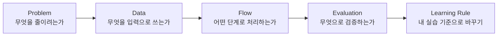

공부한 내용을 그냥 주제별로 모아두면 금방 흩어졌다. 그래서 이번에는 `개념을 어떻게 실습 가능한 설계 기준으로 바꿀 수 있는지`에 맞춰 다시 묶어봤다.

처음에는 RAG, OCR, Agent, 평가 지표를 각각 따로 봤다. 그런데 작은 예제를 직접 만들어보면 질문이 바뀐다. “이 개념이 무엇인가”보다 “이 개념을 어디에 붙여야 실패를 줄일 수 있는가”가 더 중요해진다.

## 학습 주제를 볼 때의 순서

새로운 주제를 볼 때 모델명부터 보면 길을 잃기 쉬웠다. 더 오래 남는 것은 문제 정의, 데이터 흐름, 평가 기준이었다.



이 순서를 잡으면 기술 이름에 끌려가지 않는다. 같은 RAG라도 문서 처리형 RAG인지, 금융 근거형 RAG인지, Agent가 붙은 RAG인지에 따라 봐야 할 기준이 달라진다.

## 개념을 구현 질문으로 바꾼다

개념을 읽는 것과 구현해보는 것은 다르다. 직접 만들어볼 때는 개념을 질문으로 바꿔야 한다.

| 개념 | 구현 질문 |
| --- | --- |
| PDF/OCR | 텍스트뿐 아니라 layout, table, figure를 보존했는가 |
| RAG | 검색 실패와 생성 실패를 분리해서 볼 수 있는가 |
| Reranker | Top-K 후보 중 실제 근거가 앞쪽으로 오는가 |
| G-Eval | 평가 기준이 prompt에 명확히 들어갔는가 |
| Agent | 자율 실행 전에 tool permission이 정의되었는가 |
| Multi-Agent | 역할 분리가 latency와 복잡도를 감당할 만큼 필요한가 |
| Architecture | 원본, metadata, index, log가 분리되어 있는가 |

이렇게 바꾸면 글을 쓸 때도 단순 요약이 아니라 “내가 무엇을 확인했는지”가 드러난다.

## 직접 만들어볼 때 남길 산출물

학습 정리 글이 설득력을 가지려면 읽은 내용만으로는 부족했다. 작게라도 직접 만져본 흔적이 있어야 나중에 다시 읽을 가치가 생긴다.

| 산출물 | 목적 |
| --- | --- |
| 최소 pipeline 코드 | 개념을 실행 흐름으로 이해 |
| 작은 dummy dataset | 재현 가능한 비교 기준 확보 |
| before/after 표 | 변경 효과를 조건부로 설명 |
| 실패 예시 | 한계를 숨기지 않고 원인 분리 |
| trace schema | prompt, retrieval, model 변경 추적 |
| checklist | 다음 구현에 재사용할 기준 정리 |

이때 코드를 길게 붙이는 것보다 학습용으로 재구성한 짧은 코드가 더 읽기 쉽다. 중요한 것은 이름이 아니라 설계 판단이다.

## 좋은 실습 코드는 작고 재현 가능해야 한다

실습 코드는 길다고 좋은 것이 아니다. 하나의 개념을 보여주고, 입력과 출력이 명확해야 한다.

예를 들어 RAG 평가를 공부했다면 전체 서비스를 만들기보다 다음 정도의 작은 단위가 더 낫다.

```python
from dataclasses import dataclass


@dataclass
class LearningCase:
    question: str
    expected_evidence_id: str
    retrieved_ids: list[str]
    answer: str


def split_rag_failure(case: LearningCase) -> str:
    # 검색 단계에서 근거를 못 찾았으면 생성 모델을 먼저 탓하지 않는다.
    if case.expected_evidence_id not in case.retrieved_ids:
        return "retrieval_failure"

    # 근거가 있었는데 답변이 어긋나면 prompt나 context 구성 문제로 본다.
    if not answer_uses_evidence(case.answer, case.expected_evidence_id):
        return "generation_failure"

    return "pass"
```

이 코드는 완성된 평가 시스템이 아니다. 하지만 내가 배운 핵심을 분명히 보여준다. RAG 실패를 하나로 보지 않고 retrieval failure와 generation failure로 나눠야 한다는 점이다.

## 글로 남길 때 조심할 표현

개인 학습 글에서는 표현을 조심해야 한다. 직접 확인한 범위를 넘겨 쓰면 학습 기록이 아니라 성과 주장처럼 보인다.

| 피해야 할 표현 | 바꿀 표현 |
| --- | --- |
| 구현했다 | 실습으로 재구성했다 |
| 성능을 입증했다 | 제한된 조건에서 비교했다 |
| 전체 서비스를 완성했다 | 작은 예제로 흐름을 확인했다 |
| 정확도를 높였다 | 특정 기준에서 개선 가능성을 확인했다 |
| 완성했다 | 최소 예제로 흐름을 확인했다 |

이 글의 목적은 성과 주장보다 학습 증거를 남기는 것이다. 그래서 수치가 있더라도 반드시 조건을 붙이고, 확인하지 않은 성공 claim은 쓰지 않는다.

## 학습 주제별 묶는 방식

전체 흐름은 다음 순서로 잡았다.

| 순서 | 글 | 학습 질문 |
| --- | --- | --- |
| 1 | PDF/OCR 문서 처리 | 문서 구조를 어떻게 보존할 것인가 |
| 2 | RAG 구현 패턴 | 검색 pipeline을 어떻게 나눌 것인가 |
| 3 | 금융 RAG 근거 설계 | 출처와 근거를 어떻게 분리할 것인가 |
| 4 | RAG 평가 | 검색과 생성을 어떻게 따로 평가할 것인가 |
| 5 | LLM 서비스 평가 | ROUGE, BERTScore, G-Eval을 어떻게 조합할 것인가 |
| 6 | Agent Workflow | Tool Calling과 실행 경계를 어떻게 둘 것인가 |
| 7 | LLM 서비스 아키텍처 | pipeline, storage, evaluation을 어떻게 연결할 것인가 |
| 8 | 구현 실습 회고 | 배운 개념을 다음 설계 기준으로 어떻게 바꿀 것인가 |

이 순서가 중요한 이유는 단순하다. 개념을 많이 아는 것보다, 어떤 상황에서 어떤 기준으로 선택할지 아는 것이 실습에 더 가깝기 때문이다.

## 다음 구현에 가져갈 질문

| 상황 | 확인할 것 |
| --- | --- |
| 문서 기반 QA를 만든다 | 문서 구조, metadata, evidence id |
| 금융/리포트 QA를 만든다 | source type, period, table unit, citation |
| Agent를 붙인다 | tool permission, HITL, 실패 fallback |
| 평가를 붙인다 | retrieval eval과 generation eval 분리 |
| 서비스로 만든다 | job status, trace, storage separation |
| 블로그에 정리한다 | claim boundary, 재현 가능한 예제, 설계 기준 |

이 표가 이번 학습에서 가장 오래 남은 산출물이다. 각 기술을 외우는 대신, 다음 구현에서 던질 질문 목록으로 바꿨기 때문이다.

## 마지막에 남은 기준

여러 내용을 걷어내고 나니 마지막에 남은 것은 기준표였다.

이름을 덜어내면 오히려 문제, 데이터, pipeline, 평가, 한계가 더 잘 보인다.

자료를 따라 적는 데서 멈추지 않고, 반복해서 등장한 설계 판단을 내 언어와 코드로 다시 적어보는 것. 이 시리즈는 그 연습에 가깝다.

이전 글: [LLM 서비스 아키텍처 실습 정리: Pipeline, Storage, Evaluation]()
