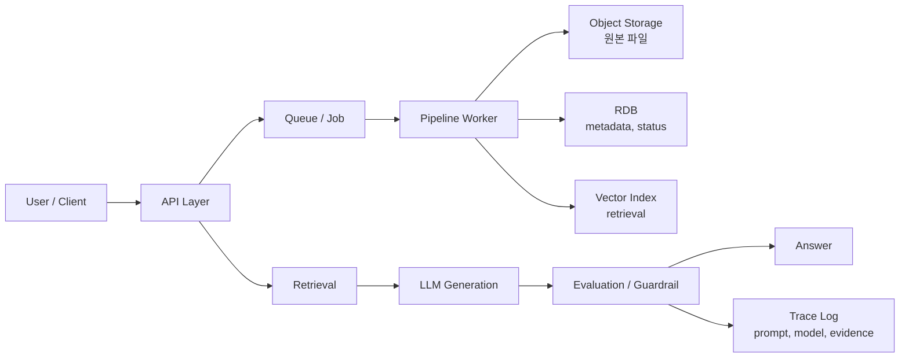

LLM 서비스를 처음 볼 때는 모델 호출 API를 중심으로 생각했다. 그런데 작은 실습으로 흐름을 다시 만들어보니, 실제 차이는 모델보다 `데이터 흐름`, `상태 관리`, `저장소 분리`, `평가 위치`에서 더 많이 났다.

같은 LLM을 사용해도 원문을 어떻게 보관하는지, 검색 결과를 어떻게 남기는지, 평가를 어느 단계에서 수행하는지에 따라 서비스의 신뢰도가 달라진다.

## 전체 구조를 나눈다

LLM 서비스는 단일 함수가 아니라 여러 단계의 pipeline이다. 특히 문서 기반 서비스나 Agent형 서비스에서는 ingestion, indexing, retrieval, generation, evaluation이 서로 다른 책임을 가진다.



실습하면서 계속 되돌아간 질문은 “어떤 데이터를 어느 저장소에 남길 것인가”였다.

| 영역 | 역할 | 주의할 점 |
| --- | --- | --- |
| Object Storage | PDF, 이미지, 원문 파일 보관 | 원본과 파생물을 구분한다 |
| RDB | 사용자, 문서, job status, metadata | 상태 전이를 명확히 남긴다 |
| Vector Index | 검색용 embedding 저장 | 원문 저장소로 착각하지 않는다 |
| Cache | 반복 요청, 임시 결과 | 정답 근거로 쓰지 않는다 |
| Log / Trace | prompt, model, retrieval 결과 기록 | 재현 가능한 단위로 남긴다 |

이렇게 나누면 장애가 났을 때 어디가 문제인지 추적하기 쉽다. 반대로 모든 것을 하나의 JSON이나 하나의 vector DB에 몰아넣으면 나중에 평가와 디버깅이 어려워진다.

## pipeline은 동기 요청으로만 처리하지 않는다

짧은 질문-답변 서비스는 API 요청 안에서 바로 처리할 수 있다. 하지만 PDF 처리, 이미지 분석, 대량 문서 embedding, Agent workflow처럼 오래 걸리는 작업은 다르게 봐야 한다.

| 처리 방식 | 적합한 경우 | 위험 |
| --- | --- | --- |
| 동기 API | 짧은 질의응답, 단순 분류 | timeout과 사용자 대기 증가 |
| 비동기 job | 문서 처리, embedding, batch 평가 | 상태 관리가 필요하다 |
| streaming | 긴 답변, 진행률 표시 | 중간 실패 처리 필요 |
| worker 분리 | 무거운 추론, 파일 변환 | queue와 retry 설계 필요 |

실습 기준으로는 API와 worker를 분리하는 순간부터 `job_id`, `status`, `retry_count`, `error_reason`이 필요해진다. 화면에는 결과만 보이지만, 실제 서비스에서는 처리 상태가 사용자 경험을 결정한다.

## 저장소를 역할별로 분리한다

RAG나 문서 기반 LLM 서비스에서 자주 헷갈리는 부분은 vector DB의 역할이다. vector DB는 검색을 위한 index이지, 전체 서비스 상태를 책임지는 DB가 아니다.

예를 들어 문서 하나를 처리할 때도 최소한 다음 정보가 분리된다.

| 데이터 | 저장 위치 | 예시 |
| --- | --- | --- |
| 원본 파일 | Object Storage | 업로드된 PDF, 이미지 |
| 문서 metadata | RDB | 문서명, 업로드 시간, 처리 상태 |
| 문서 block | RDB 또는 Document Store | section, table, figure, page |
| embedding | Vector Index | chunk vector, block vector |
| 검색 로그 | Log Store | query, top-k, score, rerank 결과 |
| 답변 로그 | Log Store | prompt version, model, evidence |

이 구조를 잡아두면 evaluation도 쉬워진다. 검색 실패인지, generation 실패인지, source parsing 실패인지 분리해서 볼 수 있기 때문이다.

## evaluation은 나중에 붙이는 기능이 아니다

처음에는 evaluation을 완성 후 점검 단계로 생각했다. 그런데 구현 관점에서는 evaluation도 architecture의 일부였다.

| 평가 위치 | 확인하는 것 |
| --- | --- |
| Ingestion 후 | 문서가 제대로 파싱되었는가 |
| Retrieval 후 | 정답 근거가 Top-K 안에 들어왔는가 |
| Reranking 후 | 중요한 근거가 앞쪽으로 올라왔는가 |
| Generation 후 | 답변이 근거 안에서 작성되었는가 |
| Release 전 | baseline 대비 개선이 있는가 |

특히 RAG에서는 “답변이 틀렸다”만 보면 원인을 알 수 없다. 문서가 잘못 잘렸는지, 검색이 실패했는지, LLM이 근거 밖으로 확장했는지 나눠서 봐야 한다.

## trace를 남겨야 개선할 수 있다

LLM 서비스는 같은 입력처럼 보여도 prompt, model, retrieval setting, chunk version에 따라 결과가 달라진다. 그래서 실습할 때도 최소한 다음 값은 남기는 편이 좋다.

| trace 항목 | 이유 |
| --- | --- |
| `request_id` | 한 요청의 전체 흐름 추적 |
| `document_id` | 어떤 원문에서 나온 결과인지 확인 |
| `chunk_version` | chunking 변경 전후 비교 |
| `retrieval_config` | top-k, hybrid, reranker 설정 확인 |
| `prompt_version` | prompt 변경 영향 비교 |
| `model_name` | 모델 변경 영향 분리 |
| `eval_version` | 평가 기준 변경 여부 확인 |

이 정보가 없으면 체감 평가만 남는다. 숫자를 기록해도 어떤 조건의 숫자인지 알 수 없으면 나중에 다시 설명하기 어렵다.

## trace가 남는 pipeline 코드

서비스 전체를 한 번에 만들기보다, trace가 남는 작은 pipeline부터 적어보는 편이 이해가 빨랐다.

```python
from dataclasses import dataclass
from typing import Any


@dataclass
class PipelineTrace:
    # trace는 단순 로그가 아니라 나중에 결과를 재현하기 위한 조건표다.
    request_id: str
    document_id: str
    chunk_version: str
    retrieval_config: dict[str, Any]
    prompt_version: str
    model_name: str
    eval_version: str


def run_llm_service_pipeline(query: str, trace: PipelineTrace) -> dict[str, Any]:
    # 검색-재정렬-생성-평가를 분리해야 어디서 실패했는지 볼 수 있다.
    candidates = retrieve(query, config=trace.retrieval_config)
    reranked = rerank(query, candidates)
    answer = generate_answer(query, reranked, prompt_version=trace.prompt_version)
    evaluation = evaluate_groundedness(answer, reranked, version=trace.eval_version)

    return {
        "answer": answer,
        "evidence": reranked[:3],
        "evaluation": evaluation,
        "trace": trace,
    }
```

핵심은 함수 이름이 아니다. 검색, 생성, 평가, trace를 한 덩어리로 뭉개지 않는 것이다.

## 실습 체크리스트

| 질문 | 확인 |
| --- | --- |
| 원본과 파생 데이터가 분리되어 있는가 | 파일, metadata, chunk, embedding |
| 긴 작업이 API 요청 안에 갇혀 있지 않은가 | job, worker, status |
| 검색 실패와 생성 실패를 분리할 수 있는가 | retrieval eval, generation eval |
| prompt와 model 변경을 추적할 수 있는가 | version, trace |
| 수치 claim에 조건이 붙어 있는가 | 데이터셋, 기준, 실험 범위 |
| 실패 예시를 다시 재현할 수 있는가 | request_id, document_id |

## 모델보다 추적 가능성

LLM 서비스 아키텍처는 모델을 잘 호출하는 구조가 아니라, 입력에서 답변까지의 흐름을 추적 가능하게 만드는 구조다.

내가 남긴 판단은 단순하다. 원본은 보존하고, 상태는 DB에 남기고, 검색은 index로 분리하고, 생성 결과는 근거와 함께 저장하고, 평가는 pipeline 안에 넣는다.

이 기준이 있어야 RAG, Agent, PDF/OCR, 평가 지표를 각각 따로 배운 내용이 하나의 서비스 설계로 연결된다.

다음 글에서는 공부한 개념을 어떻게 개인 실습 기준으로 바꿨는지 정리한다.

다음 글: [AI 서비스 구현 실습 회고: 개념을 설계 기준으로 바꾸기]()
