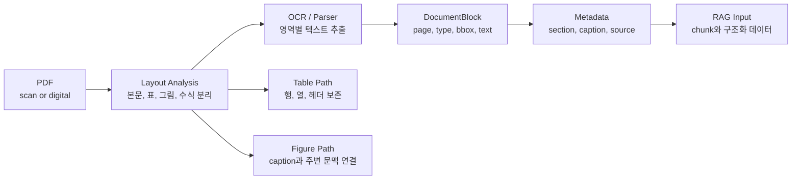

처음에는 PDF 처리를 단순하게 봤다. 파일을 넣고, parser로 텍스트를 뽑고, 그 텍스트를 RAG에 넣으면 된다고 생각했다.

문서 처리 흐름을 다시 그려보면서 생각이 바뀌었다. PDF/OCR에서 어려운 지점은 “읽는 것”보다 “읽은 결과를 어떤 구조로 남길 것인가”에 있었다. 본문, 표, 그림, 수식, 페이지 번호, caption, section 정보가 섞이면 검색 품질은 OCR 모델 하나로 해결되지 않는다.



## 내가 헷갈렸던 부분

PDF에서 텍스트를 추출하면 문서 처리가 끝난다고 생각하기 쉽다. 하지만 실제로는 텍스트가 뽑힌 뒤가 더 중요했다.

| 헷갈린 지점 | 다시 정리한 기준 |
| --- | --- |
| OCR 정확도가 높으면 충분한가 | 정확한 글자보다 문서 구조 보존이 중요하다 |
| 표는 텍스트처럼 chunking하면 되는가 | 표는 행/열 관계가 깨지면 의미가 사라진다 |
| 그림은 설명을 생략해도 되는가 | Figure/Table caption이 답변 근거가 될 수 있다 |
| 페이지 단위로 저장하면 되는가 | 질문 단위에 따라 section, figure, table metadata가 필요하다 |

PDF 처리의 목표는 “텍스트 파일 만들기”가 아니다. 나중에 검색, 요약, QA, 번역, 오디오 변환 같은 downstream 작업이 사용할 수 있는 구조를 만드는 것이다.

## 문서를 읽은 뒤 남겨야 할 것

처리 단계를 나누면 다음처럼 보였다.

| 단계 | 역할 | 체크포인트 |
| --- | --- | --- |
| Layout Analysis | 본문, 제목, 표, 그림, 수식 영역 분리 | OCR 전에 영역을 나눴는가 |
| OCR / Parser | 영역별 텍스트 추출 | 스캔본과 디지털 PDF를 분리했는가 |
| Table 처리 | 행, 열, 헤더, 셀 관계 보존 | 행 단위로 의미가 깨지지 않는가 |
| Figure 처리 | 그림 설명과 caption 연결 | 그림만 남고 설명이 사라지지 않는가 |
| Metadata 저장 | page, section, source, element type 저장 | 검색 결과가 원문 위치로 돌아갈 수 있는가 |
| RAG 입력화 | chunk와 구조화 데이터를 검색 단위로 변환 | chunk가 너무 작거나 크지 않은가 |

여기서 핵심은 `element type`을 남기는 것이다. 같은 텍스트라도 본문인지, 표의 셀인지, 그림 caption인지에 따라 답변에서 쓰이는 방식이 달라진다.

## 표 데이터는 따로 본다

표는 일반 문장과 다르다. 예를 들어 재무 리포트의 표에서 “매출”, “영업이익”, “전년 대비” 같은 값은 행과 열 관계 속에서 의미가 생긴다.

그래서 표를 RAG에 넣을 때는 다음 질문을 피할 수 없다.

| 질문 | 이유 |
| --- | --- |
| 헤더가 보존됐는가 | 셀 값만 있으면 값의 의미를 알 수 없다 |
| 행 단위와 표 단위 중 무엇을 검색할 것인가 | 너무 잘게 쪼개면 근거가 깨진다 |
| 표 주변 문단을 같이 저장할 것인가 | 표가 왜 등장했는지 설명이 필요하다 |
| 숫자 단위와 기간이 보존됐는가 | 금융/논문 문서에서는 단위 손실이 치명적이다 |

내가 보기에는 표를 Markdown이나 HTML로 변환한 뒤, 표 전체와 핵심 행을 함께 저장하는 방식이 안정적이었다. 표 전체는 맥락을 보존하고, 핵심 행은 검색 recall을 보완한다.

## Parser 선택 기준

문서 parser를 고를 때 단순히 “텍스트가 잘 나오나”만 보면 부족하다.

| 기준 | 확인할 것 |
| --- | --- |
| Layout 보존 | 제목, 문단, 표, 그림 영역을 구분하는가 |
| 표 처리 | 표를 plain text로 뭉개지 않는가 |
| 이미지 처리 | OCR이 필요한 이미지 영역을 분리하는가 |
| Metadata | page, bbox, section 정보를 남기는가 |
| 후처리 난이도 | 결과를 DB나 vector store에 넣기 쉬운가 |

PDF가 길고 복잡할수록 parser 결과를 그대로 믿기보다, 저장 전에 한 번 더 정규화하는 단계가 필요하다.

## 다음에 다시 만들 때 볼 것

다시 PDF/OCR 파이프라인을 만들면 이 순서로 확인할 것이다.

| 체크 | 질문 |
| --- | --- |
| 문서 유형 분리 | 스캔 PDF와 디지털 PDF를 구분했는가 |
| 구조 보존 | 본문, 표, 그림, 수식을 분리했는가 |
| 단위 설계 | page, section, element 중 검색 단위를 정했는가 |
| 표 보존 | 헤더와 셀 관계를 잃지 않았는가 |
| 그림 설명 | caption과 주변 문단을 연결했는가 |
| 근거 추적 | 답변에서 원문 위치로 돌아갈 수 있는가 |

## block type을 먼저 고정하는 코드

PDF/OCR 흐름을 코드로 적어보면 OCR 호출보다 먼저 block type을 고정하는 쪽이 중요했다. 문서를 읽기 전에 title, plain text, figure, table, formula처럼 block type을 나눠야 한다. 그래야 뒤에서 표는 표대로, 그림은 caption과 함께, 본문은 문단 단위로 다룰 수 있다.

설계 형태만 남기면 다음과 같다.

```python
from dataclasses import dataclass


@dataclass
class DocumentBlock:
    page: int
    block_type: str  # table/figure/formula를 잃으면 뒤에서 복구하기 어렵다.
    text: str
    bbox: tuple[int, int, int, int] | None
    metadata: dict


def normalize_layout_blocks(raw_blocks: list[dict]) -> list[DocumentBlock]:
    # parser 결과를 바로 chunk로 만들지 않고, 먼저 공통 구조로 맞춘다.
    blocks = []
    for item in raw_blocks:
        blocks.append(
            DocumentBlock(
                page=item["page"],
                block_type=item["label"],
                text=item.get("text", ""),
                bbox=item.get("bbox"),
                metadata={"source": item.get("source")},
            )
        )
    return blocks
```

핵심은 parser 결과를 바로 chunk로 만들지 않는 것이다. 먼저 문서 요소를 `DocumentBlock`으로 정규화한 뒤, RAG나 요약 단계가 필요한 단위로 다시 변환하는 편이 안전하다.

## 내가 남긴 결론

PDF/OCR 처리는 RAG 앞단의 단순 전처리로 보기 어렵다. 문서를 어떻게 읽고, 어떤 단위로 저장하고, 어떤 metadata를 남기느냐가 뒤의 검색 품질을 결정한다.

복잡한 PDF를 다룰수록 OCR 정확도만 보면 부족하다. 구조화 설계가 먼저 잡혀야 한다.
