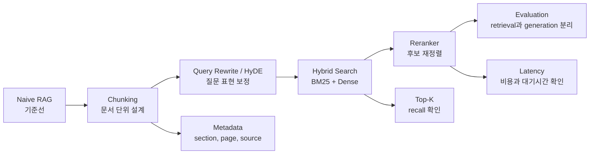

RAG를 처음 볼 때는 vector DB에 문서를 넣고 질문하면 되는 구조로 이해했다. 그런데 구현 흐름을 단계별로 나눠보니 실제 품질 차이는 그 앞뒤에서 많이 났다.

문서를 어떻게 자르는지, 질문을 어떻게 바꾸는지, 검색 결과를 어떻게 재정렬하는지, 그리고 무엇을 기준으로 평가하는지에 따라 같은 LLM을 써도 결과가 달라진다.



## baseline을 먼저 세운다

처음부터 query rewrite, HyDE, reranker, agentic retrieval을 모두 넣으면 무엇이 효과가 있었는지 알기 어렵다.

나는 아래 순서로 보는 편이 더 낫다고 느꼈다.

| 단계 | 목표 | 확인할 것 |
| --- | --- | --- |
| Naive RAG | 가장 단순한 기준선 | chunk, embedding, top-k 검색 |
| Chunk 조정 | 문서 단위 최적화 | 너무 작거나 크지 않은가 |
| Query 개선 | 질문과 문서 표현 차이 줄이기 | rewrite, sub-query, HyDE |
| Hybrid Search | 키워드와 의미 검색 결합 | BM25와 dense search 보완 |
| Reranker | Top-K 품질 개선 | 관련 chunk가 앞에 오는가 |
| 평가 | 개선 여부 측정 | retrieval과 generation 분리 |

이 순서를 지키면 막연한 체감 개선에서 멈추지 않고 “어느 지점이 좋아졌다”로 말할 수 있다.

## Chunking은 검색 품질의 시작점

chunking은 단순한 전처리가 아니다. RAG가 보는 세계를 정하는 작업이다.

| 전략 | 장점 | 위험 |
| --- | --- | --- |
| 고정 길이 chunk | 구현이 쉽고 빠르다 | 문단이나 표가 잘릴 수 있다 |
| 문단/section 기반 chunk | 의미 단위가 보존된다 | 문서 형식에 영향을 많이 받는다 |
| Parent-child chunk | 작은 단위로 찾고 큰 단위로 답한다 | index 구조가 복잡해진다 |
| 표/그림 별도 chunk | 문서 요소별 의미를 보존한다 | metadata 설계가 필요하다 |

내가 가장 중요하게 본 것은 chunk 크기보다 `chunk에 어떤 설명을 붙일 것인가`였다. 같은 문장이라도 어느 문서의 어느 section인지 알 수 없으면 답변에서 근거로 쓰기 어렵다.

## Query rewrite와 HyDE

사용자의 질문은 문서에 있는 표현과 다를 때가 많다. 이때 query rewrite가 필요하다.

예를 들어 사용자가 “이 회사가 돈을 잘 벌고 있어?”라고 물으면 문서에는 “매출액”, “영업이익”, “수익성”, “전년 대비” 같은 표현으로 흩어져 있을 수 있다.

| 방법 | 역할 |
| --- | --- |
| Query rewrite | 질문을 검색에 맞는 표현으로 바꾼다 |
| Sub-query | 복합 질문을 여러 검색 질문으로 나눈다 |
| HyDE | 가상의 답변을 만든 뒤 그 답변으로 검색한다 |

다만 query를 늘리면 검색 비용과 noise도 늘어난다. 그래서 rewrite를 붙인 뒤에는 Top-K 안에 실제 근거가 더 잘 들어오는지 봐야 한다.

## Reranker를 붙이는 이유

첫 검색 결과는 recall 중심으로 넓게 가져오는 경우가 많다. 이때 LLM에 그대로 넣으면 context noise가 생긴다.

Reranker는 검색된 후보를 다시 읽고, 질문에 더 가까운 순서로 재정렬한다.

| 비교 | 설명 |
| --- | --- |
| Vector search | 빠르게 후보를 넓게 찾는다 |
| Reranker | 후보를 더 비싸게 다시 평가한다 |
| 최종 context | reranker 이후 상위 문서를 LLM에 넣는다 |

검색 후보가 많아질수록 reranker의 가치가 커진다. 반대로 데이터가 작고 질문이 단순하면 reranker가 latency만 늘릴 수도 있다.

## 실습에서 볼 지표

RAG 구현을 비교할 때는 답변 하나만 보면 안 된다.

| 지표 | 보는 것 |
| --- | --- |
| Top-K Accuracy | 정답 근거가 검색 결과 안에 들어왔는가 |
| Recall | 관련 근거를 얼마나 놓치지 않았는가 |
| Groundedness | 답변이 검색 근거에 묶여 있는가 |
| Faithfulness | 없는 내용을 만들어내지 않았는가 |
| Latency | 검색과 재정렬이 너무 느리지 않은가 |

내가 본 예시 중에는 단순 RAG보다 advanced retrieval을 붙였을 때 점수가 올라간 경우가 있었다. 다만 이런 수치는 데이터셋과 평가 방식에 묶여 있으므로 일반 성능처럼 말하면 안 된다.

## 검색 단계를 분리한 코드

RAG 검색 흐름을 코드로 적어보면 검색기를 하나로 보지 않게 된다. rule 기반 후보 제한, BM25 sparse retrieval, dense retrieval을 순서대로 태운다. 검색 품질을 높인다는 말은 결국 후보를 넓히고, 줄이고, 다시 정렬하는 과정을 어떻게 나누느냐의 문제였다.

검색 흐름만 떼어내면 다음과 같다.

```python
def retrieve_pipeline(query: str) -> list[Document]:
    # rule filter는 정답 보장이 아니라 검색 공간을 줄이는 장치로 본다.
    filters = rule_filter.extract(query)

    # BM25로 넓게 잡고, 그 안에서 dense search를 다시 태운다.
    sparse_candidates = bm25.search(query, k=30)
    sparse_candidates = apply_filters(sparse_candidates, filters)

    query_vector = embedding_model.encode(query)
    candidate_ids = [doc.metadata["id"] for doc in sparse_candidates]

    dense_candidates = vector_store.search(
        query_vector=query_vector,
        candidate_ids=candidate_ids,
        k=5,
    )

    # LLM에 넣을 context는 reranker 이후에만 자른다.
    return reranker.rank(query, dense_candidates)[:3]
```

여기서 `rule_filter`는 정확도를 보장하는 장치가 아니다. 검색 공간을 줄이는 장치다. 그 뒤에 sparse, dense, reranker를 분리해야 어디서 실패했는지 추적할 수 있다.

## 남은 판단

RAG 구현은 “vector DB를 붙였다”로 끝나지 않는다. 실제로는 chunking, query, retrieval, reranker, evaluation을 나눠서 봐야 한다.

검색 결과가 틀렸을 때 LLM부터 바꾸면 원인을 놓치기 쉽다. 그 전에 chunk, query, Top-K를 확인하는 습관이 더 중요했다.
