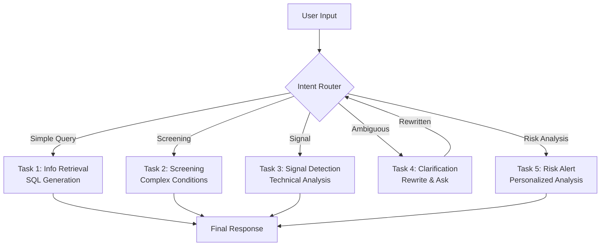

## Financial-Agent: AI 기반 금융 투자 비서

> **프로젝트 기간**: 2025.10 ~ 2025.11 (2개월)  
> **목적**: 자연어 질문으로 금융 데이터를 조회·분석하고 개인별 투자 위험을 관리하는 AI 에이전트 개발<br>


<br>

## 자연어 질문을 금융 데이터 조회와 분석으로 연결했다

Financial-Agent는 자연어 질문을 해석해 주식 시장 데이터를 조회하고 분석하는 AI 에이전트다. 가격 조회, 복합 조건 검색, 기술적 신호 감지, 모호한 질문의 재작성, 개인 투자 성향을 반영한 위험 관리를 각각 독립된 작업으로 나눴다.

<br>

## LangGraph로 작업별 실행 흐름을 분리했다

LangGraph가 상태를 관리하고, 5가지 작업을 하위 그래프로 나눠 실행하도록 설계했다.



### 작업 1: 금융 정보 조회

가격, 등락률, 시가총액과 같은 금융 정보를 자연어 질문으로 조회한다.

- **기능**: 가격 조회, 시장 통계, 순위 확인, 종목 간 비교
- **예시**: "동부건설우의 2024-11-06 시가는?", "2025-03-15에 KOSDAQ에서 상승한 종목은 몇 개?"

### 작업 2: 조건에 맞는 종목 검색

여러 조건을 AND 연산으로 결합해 조건에 맞는 종목을 찾는다.

- **기능**: 등락률, 거래량 급증, 특정 가격대 종목 필터링
- **예시**: "2025-09-05에 KOSPI에서 종가가 10만원 이상이고 거래량이 50만주 이상인 종목 알려줘"

### 작업 3: 기술적 신호 감지

RSI, 이동평균선, 볼린저밴드 같은 기술적 분석 지표로 매매 신호를 찾는다.

- **지원 지표**: RSI 과매수/과매도, 골든/데드크로스, 볼린저밴드 터치, 이동평균선 돌파
- **예시**: "2025-01-20에 RSI 과매수(70 이상) 종목을 알려줘"

### 작업 4: 모호한 질문 보완

축약어와 은어를 풀어 쓰고, 날짜나 종목명처럼 빠진 정보는 사용자에게 다시 묻는다.

- **처리 방식**:
    - **질문 재작성**: 축약어("삼전" -> "삼성전자"), 은어("떡상" -> "폭등") 변환
    - **추가 확인**: 누락된 정보(날짜, 종목명)에 대해 역질문 생성

### 작업 5: 집중 투자 위험 알림

투자자의 매매 패턴과 마이데이터(투자 성향, 자산 규모)를 분석해 과도한 집중 투자 위험을 경고한다.

- **PTPRA 모델**: Personalized Trading Pattern Risk Alert
- **기능**: 개인별 위험 임계값 산출, 뉴스 기반 매매 동기 분석, 위험 알림 보고서 생성

<br>

## 구현에 사용한 기술

### 실행 흐름

- **LangChain & LangGraph**: 에이전트 상태와 작업 흐름 관리
- **OpenAI GPT-4o**: 자연어 이해 및 SQL/JSON 생성
- **Pandas & NumPy**: 금융 데이터 전처리 및 분석

### 데이터 처리

- **yfinance**: 주식 시장 데이터 수집
- **SQLAlchemy & SQLite**: 로컬 데이터베이스 구축 및 ORM
- **BeautifulSoup & Selenium**: 뉴스 데이터 수집과 관련 내용 강조 표시

### 실행 환경

- **Docker**: 실행 환경 컨테이너화
- **FastAPI**: REST API 엔드포인트 제공

<br>

## 자연어 질문을 실행 가능한 계획으로 바꾸는 코드

### 작업 1: 자연어를 SQL로 변환

LLM이 자연어 질문을 구조화된 JSON으로 바꾸면, 실행 계층이 JSON을 SQL 쿼리로 매핑해 조회한다.

```python
def parse_question_with_llm(state: AgentState) -> Dict[str, Any]:
    # LLM을 통해 자연어를 구조화된 JSON으로 변환
    # 지원 task_type: PRICE_INQUIRY, MARKET_STATISTICS, RANKING 등
    pass

def execute_plan(state: AgentState) -> Dict[str, Any]:
    # 분석된 JSON 계획을 SQL 쿼리로 변환하여 데이터베이스 조회 실행
    # 예: {"task_type": "PRICE_INQUIRY", "stock": "삼성전자"} 
    # -> SELECT open, close FROM stocks WHERE name='삼성전자' ...
    pass
```

### 작업 5: 개인별 위험 임계값 계산

투자자의 성향과 생애주기(나이)를 반영해 개인별 위험 임계값을 계산한다.

```python
def analyze_risk_patterns(state: AgentState) -> Dict[str, Any]:
    # 1. 개인화 임계치 계산
    # 투자성향 한도(예: 위험중립형 60%) × 생애주기 계수(예: 20대 0.3)
    personalized_threshold = profile_limit * age_factor
    
    # 2. 포트폴리오 집중도 계산
    concentration = stock_value / total_asset
    
    # 3. 위험 경고 여부 판단
    if concentration > personalized_threshold:
        return create_risk_alert(stock_name, concentration, personalized_threshold)
    return {"status": "SAFE"}
```

## 설계 과정에서 익힌 것

1. **에이전트 실행 흐름**: LangGraph로 순환과 분기가 있는 실행 흐름을 설계하며 LLM 애플리케이션의 제어 지점을 나눴다.
2. **자연어를 SQL로 변환(Text-to-SQL)**: 자연어 질문을 정확한 SQL로 변환하도록 프롬프트에 스키마 정보를 구성하고, LLM의 환각을 제어하는 프롬프트 작성 방법을 익혔다.
3. **금융 규칙 반영**: 은어, 기술적 지표, 위험 관리 이론을 처리 로직에 반영해 금융 질문에 맞는 도구로 발전시켰다.

<br>

## 관련 링크

- **GitHub 저장소**: [Financial-Agent](https://github.com/figure-2/Financial-Agent) (Private)
- **API 엔드포인트**: `http://211.188.58.134:8000/agent` (데모 기간 한정)
