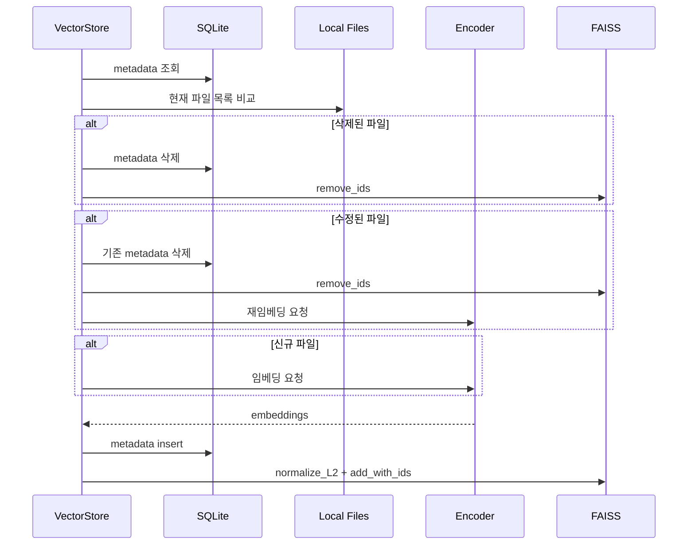

로컬 검색에서 어려운 문제는 벡터 검색 자체만이 아닙니다. 파일은 계속 추가되고, 수정되고, 삭제됩니다. VectorStore가 이 변화를 따라가지 못하면 검색 결과는 실제 폴더 상태와 어긋납니다.

LocalLens는 이 문제를 FAISS와 SQLite의 역할 분리로 풀었습니다.

| 구성 | 책임 |
| --- | --- |
| FAISS | 벡터 저장, cosine similarity 기반 검색 |
| SQLite | 파일 경로, 수정 시간, 확장자, 타입 metadata |
| Sync Logic | 로컬 파일과 metadata를 비교해 변경분만 처리 |

## 왜 둘을 나눴나

FAISS는 벡터 검색에 적합하지만 파일 상태 관리용 DB는 아닙니다. 반대로 SQLite는 경량 metadata 관리에 좋지만 벡터 유사도 검색 엔진은 아닙니다.

그래서 LocalLens는 벡터와 파일 정보를 분리했습니다.

```text
FAISS  -> id, embedding vector
SQLite -> id, file_path, mtime, extension, type
```

이 분리 덕분에 검색 시에는 FAISS가 유사한 ID를 찾고, SQLite가 해당 ID의 파일 경로를 제공합니다. 삭제나 수정이 발생하면 SQLite metadata와 FAISS index를 같은 ID 기준으로 정리합니다.

## 동기화 흐름



동기화 기준은 `mtime`이다. SQLite에 저장된 수정 시간과 현재 파일의 수정 시간이 다르면 수정된 파일로 판단한다. DB에는 있지만 로컬 폴더에는 없으면 삭제된 파일로 판단한다. 로컬에는 있지만 DB에 없으면 신규 파일이다.

## 변경 파일만 임베딩하기

모든 검색 요청마다 전체 파일을 다시 임베딩하면 로컬 데스크톱 검색기로 쓰기 어렵다. 특히 이미지와 PDF는 임베딩 비용이 더 크다.

LocalLens는 변경된 파일만 임베딩 대상으로 보낸다.

| 파일 상태 | 처리 |
| --- | --- |
| unchanged | 임베딩 생략 |
| new | 임베딩 생성 후 추가 |
| modified | 기존 벡터 삭제 후 재임베딩 |
| deleted | metadata와 FAISS ID 삭제 |

이 방식은 검색 품질을 직접 높이는 기법은 아니다. 대신 로컬 검색기가 실제 폴더 상태와 계속 맞춰지도록 만드는 운영 구조에 가깝다.

## 타입별 인덱스

LocalLens는 파일 타입별로 인덱스를 나눠 관리한다. 이미지, 텍스트, PDF는 서로 다른 인코더를 거치기 때문이다.

```text
index_image.faiss
index_text.faiss
index_docs.faiss
metadata.db
```

사용자가 이미지와 텍스트를 함께 검색하면 VectorStore는 타입별 인덱스를 순회하면서 query embedding을 만들고 검색한다. 결과는 타입별 파일 경로와 score 목록으로 반환된다.

## 설계상 한계

`mtime` 기반 동기화는 단순하고 빠르지만 모든 변경 상황을 세밀하게 설명하지는 않는다. 예를 들어 파일 내용은 바뀌었지만 수정 시간이 보존된 경우에는 감지하지 못할 수 있다. 더 엄밀한 방식이 필요하다면 content hash를 함께 저장하는 방향으로 확장할 수 있다.

또한 FAISS와 SQLite를 같이 업데이트하므로, 중간 실패 시 일관성 복구 전략이 필요하다. 프로젝트 범위에서는 local desktop prototype 수준에서 sync 흐름을 구현했고, 대규모 운영 저장소 수준의 복구 시스템까지 다루지는 않았다.

## VectorStore 구현 코드

아래는 파일 상태 관리와 벡터 색인을 담당하는 구현입니다. 설정 객체와 Encoder 등 프로젝트의 다른 모듈에 의존하는 코드이므로, 이 파일 하나만으로 실행하는 예제는 아닙니다.

<details markdown="1">
<summary markdown="span">vector_store.py 전체 코드 펼치기</summary>



```python
# 캐시 조회 저장 삭제 업데이트
import pickle
import numpy as np
from typing import List, Dict, Any, Optional, Tuple, Callable
from app.services.encoder import Encoder
import sqlite3
import os
import faiss
from collections import defaultdict
from omegaconf import DictConfig


class VectorStore:
    """
    pickle 기반 VectorStore 구현 및 조회, 삽입, 삭제 기능
    지정된 경로의 pickle 파일을 읽어 데이터베이스를 메모리에 로드

    Args:
        target_dir (str): 사용자가 지정한 디렉토리 경로
        target_extensions (Dict[str, List[str]]): 임베딩할 파일 확장자 목록
        cfg (DictConfig): 설정

    Returns:
        None
    """

    def __init__(
        self,
        target_dir: str,
        target_extensions: Dict[str, List[str]],
        cfg: DictConfig,
        progress_callback: Optional[Callable[[int, str], None]] = None,
    ):
        ROOT_DIR = os.path.abspath(
            os.path.join(os.path.dirname(__file__), "..", "..")
        )
        self.target_dir = target_dir
        self.target_extensions = target_extensions
        self.db_path = os.path.join(ROOT_DIR, cfg.db_path)
        self.sqlite_path = os.path.abspath(
            os.path.join(self.db_path, "metadata.db")
        )
        self.progress_callback = progress_callback
        # target_extensions의 키를 target_types로 활용하여 필요한 encoder만 로딩
        target_types = set(target_extensions.keys())

        # 모델 로드
        if self.progress_callback:
            self.progress_callback(0, "모델 로드 중")
        self.encoder = Encoder(cfg=cfg, target_types=target_types)
        if self.progress_callback:
            self.progress_callback(100, "모델 로드 완료")

        self.batch_size = dict(cfg.batch_size)
        self.faiss_indices = {}

        os.makedirs(self.db_path, exist_ok=True)
        with sqlite3.connect(self.sqlite_path) as conn:
            conn.execute("""
                CREATE TABLE IF NOT EXISTS metadata (
                    id INTEGER PRIMARY KEY AUTOINCREMENT,
                    file_path TEXT UNIQUE,
                    mtime REAL,
                    extension TEXT,
                    type TEXT
                )
                """)
            conn.execute(
                "CREATE INDEX IF NOT EXISTS idx_extension ON metadata(extension)"
            )

    def _update_progress(
        self,
        progress: int,
        message: str,
        callback: Optional[Callable[[int, str], None]] = None,
    ):
        """진행 상황 업데이트 헬퍼 메서드"""
        cb = callback if callback is not None else self.progress_callback
        if cb:
            cb(progress, message)

    def _load_faiss_index(
        self, type_: str, dim: Optional[int] = None
    ) -> Optional[faiss.IndexIDMap]:
        """
        인덱스를 메모리(캐시)에서 가져오거나 디스크에서 로드합니다.
        파일이 없으면 새 인덱스를 생성합니다.

        Args:
            type_ (str): 인덱스 유형
            dim (Optional[int]): 임베딩 벡터의 차원 수
        """
        faiss_index_path = self._get_faiss_index_path(type_)

        if type_ in self.faiss_indices:
            return self.faiss_indices[type_]

        if os.path.exists(faiss_index_path):
            index = faiss.read_index(faiss_index_path)
            self.faiss_indices[type_] = index
            return index

        if dim is not None:
            base_index = faiss.IndexFlatIP(dim)
            index = faiss.IndexIDMap(base_index)
            self.faiss_indices[type_] = index
            return index

        return None

    def _get_faiss_index_path(self, extension: str) -> str:
        """
        주어진 확장자에 대한 Faiss 인덱스 파일 경로를 반환합니다.
        Args:
            extension (str): 파일 확장자
        Returns:
            str: Faiss 인덱스 파일 경로
        """
        return os.path.join(self.db_path, f"index_{extension}.faiss")

    def _fetch_db_metadata(self) -> Dict[str, Dict[str, Dict[str, Any]]]:
        """
        Summary:
            주어진 디렉토리와 확장자 목록에 따라 데이터베이스에서 메타데이터를 가져옵니다.
        Args:
            target_dir (str): 사용자가 지정한 디렉토리 경로
            target_extensions (Dict[str, List[str]]): 임베딩할 파일 확장자 목록
        Returns:
            Dict[str, Dict[str, Dict[str, Any]]]: 파일 경로를 키로 하고 메타데이터를 값으로 하는 딕셔너리
            예: {'image': {'/path/to/image1.jpg': {'mtime': 1234567890.0, 'id': 1}, ...}, 'text': {...}}
        """
        with sqlite3.connect(self.sqlite_path) as conn:
            cursor = conn.cursor()

            target_extensions_flat = [
                ext
                for sublist in self.target_extensions.values()
                for ext in sublist
            ]
            place_holders = ", ".join(["?"] * len(target_extensions_flat))
            cursor.execute(
                f"SELECT file_path, mtime, id, type FROM metadata WHERE file_path LIKE ? AND extension IN ({place_holders})",
                ([f"{self.target_dir}%"] + target_extensions_flat),
            )
            db_files = defaultdict(dict)
            for row in cursor.fetchall():
                path, mtime, id_, type_ = row
                db_files[type_][path] = {"mtime": mtime, "id": id_}

        return dict(db_files)

    def _remove_data(self, to_delete_ids: Dict[str, List[int]]) -> None:
        """
        Summary:
            주어진 ID 목록에 따라 데이터베이스와 Faiss 인덱스에서 데이터를 삭제합니다.
        Args:
            to_delete_ids (Dict[str, List[int]]): 삭제할 데이터의 ID 목록
        """
        with sqlite3.connect(self.sqlite_path) as conn:
            cursor = conn.cursor()
            for type_, ids in to_delete_ids.items():
                if not ids:
                    continue
                placeholders = ", ".join(["?"] * len(ids))
                cursor.execute(
                    f"DELETE FROM metadata WHERE id IN ({placeholders})", ids
                )
                index = self._load_faiss_index(type_)
                faiss_index_path = self._get_faiss_index_path(type_)
                if index:
                    id_array = np.array(ids).astype("int64")
                    index.remove_ids(id_array)
                    faiss.write_index(index, faiss_index_path)
                    self.faiss_indices[type_] = index
            conn.commit()

    def _add_data(
        self,
        to_embed_paths: Dict[str, List[str]],
        embed_list: Dict[str, List[List[float]]],
    ) -> None:
        """
        Summary:
            주어진 파일 경로와 임베딩 목록에 따라 데이터베이스와 Faiss 인덱스에 데이터를 추가합니다.
        Args:
            to_embed_paths (Dict[str, List[str]]): 임베딩할 파일 경로 목록
            embed_list (Dict[str, List[List[float]]]): 파일 경로에 해당하는 임베딩 벡터 목록
        """
        with sqlite3.connect(self.sqlite_path) as conn:
            cursor = conn.cursor()

            for type_, paths in to_embed_paths.items():
                embeddings = embed_list.get(type_, [])
                if not embeddings:
                    continue
                faiss_index_path = self._get_faiss_index_path(type_)
                dim = len(embeddings[0])
                index = self._load_faiss_index(type_, dim)
                new_ids = []

                for path in paths:
                    mtime = os.path.getmtime(path)
                    extension = os.path.splitext(path)[1].lower()
                    cursor.execute(
                        "INSERT INTO metadata (file_path, mtime, extension, type) VALUES (?, ?, ?, ?)",
                        (path, mtime, extension, type_),
                    )
                    new_ids.append(cursor.lastrowid)

                vectors_np = np.array(embeddings).astype("float32")

                faiss.normalize_L2(vectors_np)
                ids_np = np.array(new_ids).astype("int64")
                index.add_with_ids(vectors_np, ids_np)
                faiss.write_index(index, faiss_index_path)
                self.faiss_indices[type_] = index

            conn.commit()

    def sync_vector_store(
        self,
        local_files: Dict[str, List[str]],
    ) -> None:
        """
        Summary:
            주어진 디렉토리와 확장자 목록에 따라 파일들을 임베딩하고 벡터 스토어에 저장합니다.
        Args:
            local_files: (Dict[str, List[str]]): 임베딩할 파일들의 전체 경로 리스트
            예: {'image': ['/path/to/image1.jpg', '/path/to/image2.png'], 'text': ['/path/to/doc1.txt']}
        """
        self._update_progress(0, "벡터 스토어 동기화 준비 중")
        db_files = self._fetch_db_metadata()
        to_delete_ids = defaultdict(
            list
        )  # db에서 삭제할 것: 로컬에서 삭제된 것, 수정된 것, faiss에서 삭제하기 위해 faiss index(id)를 담음
        to_embed_paths = defaultdict(
            list
        )  # 임베딩 해야할 것: 로컬에서 수정된 것, 새로 생긴 것. 임배딩 생성을 위해 path를 담음

        self._update_progress(5, "변경된 파일 확인 중")
        for type, files in db_files.items():
            for path, info in files.items():
                if path not in local_files.get(type, []):
                    to_delete_ids[type].append(info["id"])
                elif info["mtime"] != os.path.getmtime(path):
                    to_delete_ids[type].append(info["id"])
                    to_embed_paths[type].append(path)

        for type_, paths in local_files.items():
            to_embed_paths[type_].extend(
                list(set(paths) - set(db_files.get(type_, {}).keys()))
            )

        self._update_progress(10, "삭제할 파일 처리 중")
        self._remove_data(to_delete_ids)

        total_files = sum(len(paths) for paths in to_embed_paths.values())
        if total_files > 0:
            self._update_progress(
                15, f"임베딩 생성 중 (총 {total_files}개 파일)"
            )
            embed_list = self.encoder.create_embedding_list(
                dict(to_embed_paths), self.batch_size
            )
            self._update_progress(90, "인덱스 업데이트 중")
            self._add_data(dict(to_embed_paths), embed_list)
        else:
            self._update_progress(90, "새로운 파일 없음")

        self._update_progress(100, "벡터 스토어 동기화 완료")

    def search(
        self,
        query: str,
        top_k: int,
        progress_callback: Optional[Callable[[int, str], None]] = None,
    ) -> Dict[str, List[Tuple[str, float]]]:
        """
        코사인 유사도를 통해 쿼리와 유사한 절대경로를 topk개 반환

        Args:
            query (str): 자연어 쿼리
            topk (int): 반환할 유사도 상위 개수
            progress_callback (Callable[[int, str], None], optional): 진행 상황 콜백 함수
                None이면 self.progress_callback 사용

        Returns:
            Dict[str, List[Tuple[str, float]]]: 유사도 상위 topk개의 절대경로와 유사도 점수
            예: {'image': [('/path/to/similar_image1.jpg', 0.95), ...], 'text': [('/path/to/similar_doc1.txt', 0.89), ...]}
        """
        self._update_progress(25, "메타데이터 조회 중", progress_callback)
        db_files = self._fetch_db_metadata()
        allowed_indices = {}

        for type_, paths_dict in db_files.items():
            type_id_map = {}
            for path, info in paths_dict.items():
                row_id = info["id"]
                type_id_map[row_id] = path
            allowed_indices[type_] = type_id_map

        self._update_progress(30, "검색 실행 중", progress_callback)
        type_list = list(allowed_indices.items())
        results = defaultdict(list)

        for type_idx, (type_, id_map) in enumerate(type_list):
            index = self._load_faiss_index(type_)
            if index is None or index.ntotal == 0:
                continue

            if len(type_list) > 0:
                progress = 30 + int(
                    (type_idx / len(type_list)) * 60
                )  # 30-90% 범위
                type_name = (
                    "이미지"
                    if type_ == "image"
                    else (
                        "텍스트"
                        if type_ == "text"
                        else (
                            "음성"
                            if type_ == "voice"
                            else "문서" if type_ == "docs" else type_
                        )
                    )
                )
                self._update_progress(
                    progress, f"{type_name} 검색 중", progress_callback
                )

            # 타입별 쿼리 임베딩 생성
            try:
                query_embedding = self.encoder.create_query_embedding(query, type_)
                query_vector = (
                    np.array(query_embedding).astype("float32").reshape(1, -1)
                )
                faiss.normalize_L2(query_vector)
            except KeyError:
                continue

            id_array = np.array(list(id_map.keys())).astype("int64")
            selector = faiss.IDSelectorBatch(id_array)
            params = faiss.SearchParameters(sel=selector)

            D, I = index.search(query_vector, top_k, params=params)
            for idx, score in zip(I[0], D[0]):
                if idx == -1:
                    continue
                results[type_].append((id_map[idx], float(score)))

        self._update_progress(100, "검색 완료", progress_callback)
        return dict(results)
```



</details>


## 다음 글

다음 글에서는 VectorStore 뒤에서 실제 임베딩을 처리하는 Encoder 구조와 모델 선택을 정리한다.

[05. Text, Image, PDF Encoder를 하나의 검색 흐름으로 묶기]()
