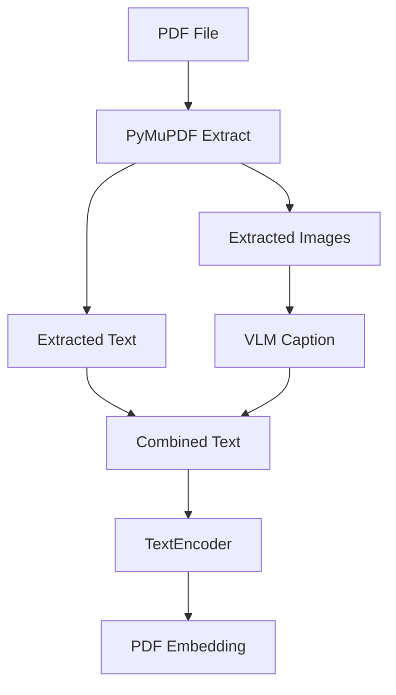

PDF 검색은 텍스트 파일 검색보다 까다롭습니다. PDF 안에는 본문 텍스트뿐 아니라 표, 그래프, 다이어그램, 이미지가 함께 들어갈 수 있습니다. 텍스트만 추출하면 검색해야 할 맥락 일부가 빠집니다.

LocalLens는 PDF를 `텍스트 추출 + 이미지 설명 + 텍스트 임베딩` 흐름으로 처리했습니다.


## PDF 처리 흐름



PyMuPDF는 PDF에서 텍스트와 이미지를 추출합니다. 텍스트는 그대로 검색 맥락이 됩니다. 이미지, 표, 그래프처럼 텍스트로 바로 검색하기 어려운 요소는 VLM caption으로 설명 문장을 만듭니다.

최종적으로는 다음 형태의 텍스트를 만듭니다.

```text
PDF에서 추출한 본문 텍스트

[이미지/표/그래프 설명]

VLM이 생성한 시각 요소 설명
```

이 combined text를 TextEncoder에 넣어 PDF embedding을 만듭니다.

## 왜 VLM caption을 붙였나

PDF 안의 그래프는 사람에게는 정보지만, 단순 텍스트 추출기에는 빈 영역에 가깝다. 표나 다이어그램도 마찬가지다. 검색어가 시각 요소와 관련되어 있다면 텍스트만 추출한 embedding은 충분하지 않을 수 있다.

VLM caption은 이 빈틈을 줄이기 위한 방법이다.

| 방식 | 장점 | 한계 |
| --- | --- | --- |
| Text only | 빠르고 단순함 | 이미지/표/그래프 정보가 빠질 수 있음 |
| Text + VLM caption | 시각 정보를 검색 맥락에 추가 | 외부 VLM 호출과 caption 품질 의존 |

발표 기준으로 PDF text-only 방식과 text+VLM caption 방식을 비교했고, text+VLM 방식이 평가 지표에서 소폭이지만 일관된 개선을 보였다고 정리되어 있다. 다만 구체 수치를 재현할 표나 재실행 결과가 충분히 남아 있지는 않아, 여기서는 개선 방향까지만 기록한다.

## 코드 구조상 처리 지점

PDF 처리의 책임은 크게 두 곳에 나뉜다.

| 컴포넌트 | 역할 |
| --- | --- |
| PdfProcessor | 텍스트와 이미지 추출, VLM caption 생성, combined text 구성 |
| PdfEncoder | combined text를 TextEncoder로 임베딩 |

PdfEncoder가 직접 VLM 호출 세부 사항을 모두 들고 있지 않고, PDF 처리 유틸리티가 combined text를 만든다. 이후 PdfEncoder는 TextEncoder를 재사용한다.

이 구조는 PDF를 “새로운 벡터 모델이 필요한 파일”이 아니라 “텍스트와 시각 설명을 결합해 텍스트 임베딩으로 보낼 파일”로 다룬다.

## Local-first 표현의 경계

PDF+VLM 구조 때문에 LocalLens를 순수 오프라인 검색기라고 표현하면 부정확하다. 텍스트와 이미지 파일 검색은 로컬 파일 시스템과 로컬 VectorStore 중심으로 돌아가지만, PDF 내부 이미지 captioning에는 외부 VLM 호출이 들어간다.

그래서 이 프로젝트의 정확한 표현은 다음에 가깝다.

| 표현 | 판단 |
| --- | --- |
| local-first를 지향한 로컬 파일 검색 구조 | 사용 가능 |
| PDF 이미지 captioning에는 외부 VLM 호출 사용 | 사용 가능 |
| 오프라인 전용 검색기 | 사용하지 않음 |
| 모든 PDF 시각 정보 처리 | 사용하지 않음 |

## 개선 방향

PDF+VLM 구조의 후속 개선은 세 가지다.

| 개선 | 이유 |
| --- | --- |
| caption caching | 같은 PDF를 반복 처리할 때 호출 비용과 시간을 줄임 |
| local VLM 검토 | 외부 호출 의존도를 낮춤 |
| 평가 데이터 보강 | text-only, OCR, text+VLM 방식을 더 명확히 비교 |

이 글의 핵심은 VLM을 붙였다는 사실이 아니다. PDF의 시각 요소를 검색 가능한 텍스트 맥락으로 바꾸고, 그 맥락을 기존 TextEncoder 흐름에 태웠다는 점이다.

## PDF 처리 구현 코드

아래는 PDF의 텍스트와 이미지를 추출하고, 이미지 설명을 검색용 텍스트에 결합하는 구현입니다. VLM 제공자는 설정에 따라 선택하며, 기본값은 mock입니다. 따라서 이 코드의 존재만으로 외부 VLM 호출이나 품질 검증이 완료됐다고 볼 수는 없습니다.

<details markdown="1">
<summary markdown="span">pdf_processor.py 전체 코드 펼치기</summary>



```python
# PDF 처리: PyMuPDF(fitz)로 텍스트 추출 + 이미지/표/그래프는 VLM으로 텍스트화
from pathlib import Path
from typing import List, Optional, Tuple

import fitz  # PyMuPDF
from PIL import Image
import io

from app.services.vlm_clova import ClovaStudioVLM
from app.services.vlm_mock import MockVLM


def _get_vlm_client(cfg):
    vlm_cfg = getattr(cfg, "vlm", None)
    provider = (
        (getattr(vlm_cfg, "provider", None) or "mock") if vlm_cfg else "mock"
    )
    if provider == "clova_studio":
        return ClovaStudioVLM(cfg)
    if provider == "mock":
        return MockVLM()
    raise ValueError(f"Unknown VLM provider: {provider}")


def extract_text_and_images(
    pdf_path: str,
    min_image_pixels: int = 1000,
) -> Tuple[str, List[Tuple[bytes, str]]]:
    """
    PDF에서 텍스트와 이미지(그래프/표 포함)를 추출합니다.

    Args:
        pdf_path: PDF 파일 절대 경로
        min_image_pixels: 최소 픽셀 수 (width*height). 이보다 작은 이미지는 스킵

    Returns:
        (전체_텍스트, [(이미지_bytes, 확장자), ...])
    """
    text_parts: List[str] = []
    images: List[Tuple[bytes, str]] = []

    doc = fitz.open(pdf_path)
    try:
        for page_num in range(len(doc)):
            page = doc[page_num]

            page_text = page.get_text()
            if page_text.strip():
                text_parts.append(page_text)

            for img_info in page.get_images(full=True):
                xref = img_info[0]
                try:
                    base_img = doc.extract_image(xref)
                    img_bytes = base_img["image"]
                    ext = base_img["ext"]
                    w, h = base_img["width"], base_img["height"]
                    if w * h < min_image_pixels:
                        continue
                    if ext.lower() == "jpeg":
                        ext = "jpg"
                    images.append((img_bytes, ext))
                except Exception:
                    continue
    finally:
        doc.close()

    full_text = "\n\n".join(text_parts) if text_parts else ""
    return full_text, images


def image_to_text_vlm(
    images: List[Tuple[bytes, str]],
    vlm_client,
    prompt: str = "이 이미지(그래프, 표, 다이어그램 등)의 내용을 설명하는 텍스트로 요약해 주세요.",
) -> str:
    """
    이미지 리스트를 VLM에 넣어 각각 텍스트로 변환한 뒤 하나의 문자열로 합칩니다.
    bytes → PIL Image로 변환 후 describe_image에 넘깁니다 (PNG optimize 저장).
    """
    if not images or not vlm_client:
        return ""
    texts = []
    for img_bytes, _ in images:
        try:
            pil_image = Image.open(io.BytesIO(img_bytes))
            desc = vlm_client.describe_image(pil_image, prompt=prompt)
            if desc:
                texts.append(desc.strip())
        except Exception as e:
            texts.append(f"[이미지 설명 오류: {e}]")
    return "\n\n".join(texts)


def pdf_to_combined_text(
    pdf_path: str,
    cfg,
    vlm_client=None,
    min_image_pixels: Optional[int] = None,
) -> str:
    """
    PDF 경로를 받아:
    1) PyMuPDF로 추출한 텍스트
    2) 이미지/그래프/표는 VLM으로 설명 텍스트화
    두 부분을 합쳐 하나의 문자열로 반환합니다. 이 문자열을 텍스트 인코더에 넣어 임베딩합니다.

    Args:
        pdf_path: PDF 파일 절대 경로
        cfg: 앱 설정 (vlm, model 등)
        vlm_client: None이면 cfg에서 생성
        min_image_pixels: None이면 cfg.vlm.min_image_pixels 사용

    Returns:
        텍스트_추출본 + "\n\n" + VLM_이미지_설명 텍스트
    """
    vlm_cfg = getattr(cfg, "vlm", None)
    use_vlm = vlm_cfg and getattr(vlm_cfg, "enabled", True)
    min_px = min_image_pixels
    if min_px is None and vlm_cfg:
        min_px = getattr(vlm_cfg, "min_image_pixels", 1000) or 1000
    if min_px is None:
        min_px = 1000

    full_text, images = extract_text_and_images(
        pdf_path, min_image_pixels=min_px
    )

    vlm_text = ""
    if use_vlm and images:
        if vlm_client is None:
            vlm_client = _get_vlm_client(cfg)
        vlm_text = image_to_text_vlm(images, vlm_client)

    # 3가지 경우
    if full_text and vlm_text:
        return (
            full_text.rstrip() + "\n\n[이미지·표·그래프 설명]\n\n" + vlm_text
        )
    if vlm_text:
        return "[이미지·표·그래프 설명]\n\n" + vlm_text
    return full_text


def pdf_to_text_only(
    pdf_path: str,
    min_image_pixels: int = 1000,
) -> str:
    """
    PDF에서 텍스트만 추출합니다 (이미지/표/그래프는 무시).
    비교 실험용 베이스라인: VLM 없이 PyMuPDF 텍스트만 사용할 때의 품질 측정.

    Args:
        pdf_path: PDF 파일 절대 경로
        min_image_pixels: extract_text_and_images에 전달 (이미지 추출 시 필터용, 텍스트에는 미사용)

    Returns:
        추출된 텍스트만 이어 붙인 문자열
    """
    full_text, _ = extract_text_and_images(
        pdf_path, min_image_pixels=min_image_pixels
    )
    return full_text or ""


def pdf_to_ocr_text(
    pdf_path: str,
    dpi_scale: float = 2.0,
    lang: Optional[List[str]] = None,
) -> str:
    """
    PDF 각 페이지를 이미지로 렌더링한 뒤 OCR로 텍스트 추출.
    비교 실험용: PyMuPDF 텍스트만 / OCR / 텍스트+VLM 중 OCR 베이스라인.
    easyocr 사용 (한국어·영어). 미설치 시 빈 문자열 반환.
    """
    try:
        import easyocr
        import numpy as np
    except ImportError:
        return ""

    if lang is None:
        lang = ["ko", "en"]

    doc = fitz.open(pdf_path)
    parts: List[str] = []
    try:
        reader = easyocr.Reader(lang, gpu=False, verbose=False)
        for page_num in range(len(doc)):
            page = doc[page_num]
            mat = fitz.Matrix(dpi_scale, dpi_scale)
            pix = page.get_pixmap(matrix=mat, alpha=False)
            img = np.frombuffer(pix.samples, dtype=np.uint8).reshape(
                pix.height, pix.width, pix.n
            )
            result = reader.readtext(img)
            page_text = " ".join(t[1] for t in result if t[1].strip())
            if page_text.strip():
                parts.append(page_text.strip())
    finally:
        doc.close()

    return "\n\n".join(parts) if parts else ""


def pdf_to_text_plus_ocr(
    pdf_path: str,
    dpi_scale: float = 2.0,
    lang: Optional[List[str]] = None,
) -> str:
    """
    페이지별로 PyMuPDF 텍스트 + 해당 페이지 이미지 OCR 텍스트를 합쳐 반환.
    텍스트+그림(OCR) 베이스라인: 내장 텍스트와 OCR로 읽은 전체 페이지 내용을 함께 사용.
    """
    try:
        import easyocr
        import numpy as np
    except ImportError:
        return pdf_to_text_only(pdf_path)

    if lang is None:
        lang = ["ko", "en"]

    doc = fitz.open(pdf_path)
    page_parts: List[str] = []
    try:
        reader = easyocr.Reader(lang, gpu=False, verbose=False)
        for page_num in range(len(doc)):
            page = doc[page_num]
            page_text = (page.get_text() or "").strip()
            mat = fitz.Matrix(dpi_scale, dpi_scale)
            pix = page.get_pixmap(matrix=mat, alpha=False)
            img = np.frombuffer(pix.samples, dtype=np.uint8).reshape(
                pix.height, pix.width, pix.n
            )
            result = reader.readtext(img)
            ocr_text = " ".join(t[1] for t in result if t[1].strip()).strip()
            if page_text and ocr_text:
                page_parts.append(page_text + "\n\n[OCR]\n\n" + ocr_text)
            elif page_text:
                page_parts.append(page_text)
            elif ocr_text:
                page_parts.append(ocr_text)
    finally:
        doc.close()

    return "\n\n".join(page_parts) if page_parts else ""
```



</details>

## 다음 글

다음 글에서는 발표 기준 정량 평가, 현재 테스트 코드의 한계, 그리고 이 프로젝트를 공개 포트폴리오로 정리할 때의 claim boundary를 정리한다.

[07. 정량 평가, 테스트 한계, 그리고 LocalLens 회고]()
