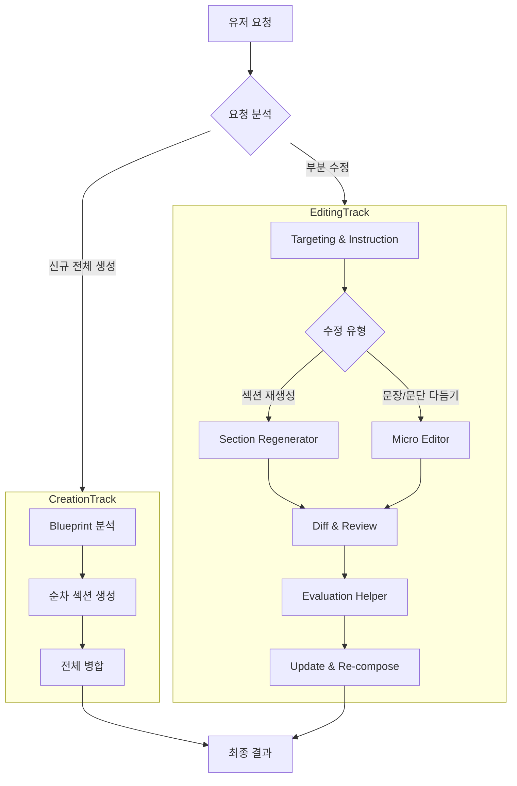

부분 문서 수정 기능의 v2·v3 설계안과 구현 로드맵을 정리합니다. 아래 내용은 당시의 제안이며, 전체 구현이 완료됐다는 의미는 아닙니다.



# 부분 문서 수정을 위한 에이전트 아키텍처 제안 (v2)

기존 파이프라인(전체 루프)과 차별화된 **'편집 트랙(Editing Track)'**을 신설하여, 유저의 부분 수정 요청을 효율적으로 처리합니다.
유저 피드백을 반영하여 State 구조 개선, 검증(Evaluation) 단계 추가, 그리고 모듈 분리 방안을 구체화했습니다.

## 1. 아키텍처 개요: Dual Track

요청의 성격에 따라 두 가지 파이프라인 중 하나로 라우팅합니다.



## 2. State & Data Structure 설계

**핵심 변경**: `GlobalState`의 `sections`가 단순 `List[str]`이면 타겟팅이 어렵습니다. 이를 ID와 메타데이터를 포함한 `List[Dict]` 형태로 통일할 것을 제안합니다.

### A. GlobalState (Base State) 수정 제안
```python
class PlanState(TypedDict):
    # 기존: sections: Annotated[List[str], '생성된 섹션 본문 리스트']
    # 변경: ID 기반 관리를 위해 Dict 구조로 변경
    sections: Annotated[List[Dict[str, Any]], '섹션 리스트 (id, title, content, visual_idx 등)'] 
    final_markdown: Annotated[str, '합쳐진 전체 마크다운 문자열']
    # ...
```

### B. PlanPipelineState (Internal) 확장
편집 작업에 필요한 임시 필드들을 추가합니다.

```python
class PlanInternalState(GlobalState):
    # ... 기존 필드 ...
    
    # [Editing Extensions]
    target_section_id: str | None       # 수정 대상 섹션 ID
    edit_instruction: str | None        # 구체적 수정 지침 ("이 문단 좀 더 부드럽게")
    edit_type: str                      # 'regenerate' (전체) vs 'refine' (부분)
    
    original_content: str | None        # 수정 전 내용 (Diff 생성용)
    revised_content: str | None         # 수정 후 내용 (후보)
    
    evaluation_result: Dict[str, Any]   # (Optional) 변경 관련 평가 결과
```

## 3. 상세 프로세스 (Editing Flow)

### Step 1: Targeting (타겟 식별)
*   **Input**: 유저의 자연어 요청, 현재 `sections` 리스트 (Metadata 포함)
*   **Logic**: LLM이 유저 요청이 가리키는 섹션을 찾아 `target_section_id`를 설정합니다.
*   **Note**: `sections`가 구조화되어 있어야 정확도가 높습니다.

### Step 2: Context Loading & Routing
*   **Context**: 타겟 섹션의 `content`, 앞뒤 섹션의 `summary`(또는 `title`), 그리고 전체 `Blueprint`.
*   **Routing**:
    *   **Regenerate**: "내용이 부족해", "다시 써줘" -> 아예 섹션을 새로 씁니다 (Drafting Agent 재사용 가능).
    *   **Refine**: "말투가 딱딱해", "첫 문장만 고쳐줘" -> 기존 텍스트를 `rewrite` 합니다 (Editing Agent).

### Step 3: Editing (The Editor Agent)
*   **Role**: 전문 교정자/에디터.
*   **Prompting**:
    *   **Input**: `Original Text`, `User Instruction`, `Context(Blueprint)`
    *   **Task**: "Guideline: Apply the user's instruction to the text. Do NOT change the core meaning defined in the Blueprint unless asked."
*   **IdeaAgent 협력**: 만약 수정 요청이 "주제를 바꿔줘" 처럼 Blueprint를 거스르는 경우, `IdeaAgent`를 호출하여 Blueprint 수정부터 다시 밟아야 할지 판단하는 로직이 이상적이나, **초기 구현에서는 Editor가 Blueprint 범위를 넘지 않도록 제약**하는 것이 복잡도를 줄이는 길입니다.

### Step 4: Diff & Review (Acceptance)
*   곧바로 덮어쓰기보다, 수정 전/후를 비교합니다. 추후 UI에서 "변경 사항 보기" 기능을 지원하기 위함입니다.
*   단순 구현: `original_content`와 `revised_content`를 모두 저장해둡니다.

### Step 5: Evaluation (Interface)
*   현재 자동 평가 로직이 없더라도, 파이프라인상에 `Evaluation Node` 자리를 만들어둡니다.
*   **역할**: 수정된 내용이 Blueprint의 의도를 벗어나지 않았는지(Consistency Check), 문법 오류는 없는지 확인.
*   **Implementation**: 지금은 `pass`만 하는 더미 노드로 두고, 나중에 `ValidatorAgent`를 연결합니다.

### Step 6: Merging
*   `sections` 리스트에서 해당 ID의 객체를 찾아 `content`를 업데이트합니다.
*   `final_markdown`을 다시 조합(join)합니다.

## 4. 모듈 구조 제안 (Module Structure)

기능별 응집도를 높이고 확장성을 가지기 위해 다음과 같은 디렉토리 구조를 제안합니다.

```text
src/agents/plan/
├── pipeline/           # 그래프 정의 (StateGraph), 파이프라인 오케스트레이션
│   ├── creation.py     # (구 pipeline.py) 생성 파이프라인
│   └── editing.py      # [NEW] 편집 파이프라인
├── generators/         # [Renamed from nodes?] 생성 관련 노드 로직
│   ├── drafting.py     # 섹션 초안 작성
│   └── layout.py       # 목차/구조 잡기
├── editors/            # [NEW] 편집 관련 노드/로직
│   ├── targeting.py    # 섹션 식별
│   └── refiner.py      # 문장/문단 교정
├── visual/             # 시각화 관련 (기존 유지)
│   ├── decision.py
│   └── generator.py
└── utils/              # 공통 유틸 등
```

**"plan_core/visual", "generate", "edit"** 로 나누는 유저의 제안도 훌륭하며, 위 구조는 그 의도를 반영하여 코드 레벨에서 구체화한 것입니다.

## 5. Action Plan

1.  **State Migration**: `src/state/base.py`의 `PlanState` 내 `sections` 타입을 `List[Dict]`로 변경 (하위 호환성 주의).
2.  **Refactoring**: 기존 `nodes.py`의 비대한 로직을 `generators/`, `visual/` 등으로 분산.
3.  **New Agent**: `src/agents/plan/editors/` 패키지 생성 및 `Targeting`, `Refining` 로직 구현.
4.  **Graph Update**: `plan_graph.py`에 `edit_workflow` 서브그래프 추가.

---

# 부분 문서 수정을 위한 에이전트 아키텍처 제안 (v3: Final)

유저의 심층 피드백을 반영하여, **현실적인 리팩토링 비용**과 **장기적인 유지보수성** 사이의 균형을 맞춘 최종 안입니다.

## 1. 쟁점 분석 및 해결 방안

### A. State 구조: `List[String]` vs `List[Dict]`
> **Q:** "GlobalState를 `List[Dict]`로 바꾸면 대공사가 일어나지 않나? 메타데이터 관리의 효율적인 방법은?"

**분석 (Analysis):**
*   **현재 상황**: `PlanInternalState`(내부)는 이미 `List[Dict]`를 사용 중일 가능성이 높으나, `GlobalState`(외부)는 `List[str]`로 정의되어 있어 정보(ID, 시각화 매핑) 손실이 발생합니다.
*   **Trade-off**:
    *   `List[str]` 유지: 다른 모듈 수정 불필요(장점). 하지만 에디터 기능(특정 위치 수정, 시각화 매핑) 구현 시 "몇 번째 문단인지" 매번 파싱해야 함(치명적 비효율).
    *   `List[Dict]` 변경: 초기 리팩토링 비용 발생(단점). 하지만 에디터 앱의 필수 데이터 구조(ID 기반 관리) 확보.

**제안 (Recommendation): "점진적 마이그레이션 (Dual Property Strategy)"**
당장의 `List[str]` 의존성을 끊기 어렵다면, State에 두 필드를 병행합니다.
*   `sections_text: List[str]` (Legacy/Display용, Computed Property처럼 동작)
*   **`sections_data: List[SectionModel]` (Core Logic용, 실제 Source of Truth)**
    *   *나중에 `sections_text`는 `[s['content'] for s in sections_data]` 형태로 동적 생성하여 반환.*

### B. State 세분화 (Granularity)
> **Q:** "PlanInternal, Vis, Gen, Edit State로 나누는 게 좋을까?"

**제안:** **적극 찬성 (Separation of Concerns)**
각 파이프라인이 전용 State를 가지면, 불필요한 데이터가 컨텍스트에 섞이는 것을 방지할 수 있습니다.

```python
# 계층 구조 (Hierarchy)
GlobalState
└── PlanState (Shared Output)
    ├── CreationState (For Generation Loop)
    ├── EditingState (For User Interaction)
    └── VisualState (For Chart Gen)
```

### C. 콘텐츠 관리 단위: 문장 vs 섹션
> **Q:** "문장 단위로 관리? 비즈니스 톤 매너 유지는?"

**제안:** **"섹션(Section) 단위 관리 & 마크다운 네이티브"**
*   **이유**: LLM은 문장 단위로 쪼개서 생성하면 문맥(Flow)이 끊겨 "로봇 같은 글"이 나옵니다. 비즈니스 톤앤매너는 문단 간의 호흡에서 나옵니다.
*   **전략**:
    *   데이터 저장: **섹션 단위 (`Dict`)**
    *   수정 처리: 유저가 "이 문장 고쳐줘"라고 해도, 에이전트는 **"해당 문장이 포함된 문단/섹션 전체"를 재작성(Rewrite)** 하여 덮어씌웁니다.
    *   이 방식이 문맥 자연스러움과 데이터 관리 단순함(ID 갯수 적음)의 최적점입니다.

### D. 모듈 이름: Pipeline vs Graph
**제안:** **`graphs` (또는 `workflows`)**
*   LangGraph를 사용하므로 `graphs`가 가장 직관적입니다. (`pipeline`은 선형적인 느낌이 강함)
*   `src/agents/plan/graphs/creation.py`, `src/agents/plan/graphs/editing.py`

---

## 2. 최종 아키텍처 청사진

### 디렉토리 구조 (Directory Structure)
```text
src/
└── agents/
    └── plan/
        ├── states/             # [NEW] State 정의 분리
        │   ├── base.py         # PlanState (Shared)
        │   ├── creation.py     # Section Generation Loop용
        │   └── editing.py      # User Modification용
        ├── graphs/             # [Renamed from pipeline]
        │   ├── main.py         # Router (Creation vs Edit)
        │   ├── creation.py     # 생성 루프
        │   └── editing.py      # 편집 워크플로우
        └── components/         # [Renamed from nodes] 순수 로직/함수
            ├── generator.py
            ├── editor.py       # (Refiner, Rewriter)
            └── visual.py
```

### 데이터 구조 (State Definitions)

```python
# src/agents/plan/states/base.py
class SectionModel(TypedDict):
    id: str             # UUID
    type: str           # "text", "visual", "container"
    content: str        # Markdown Text
    metadata: Dict      # { "visual_ref": "chart_1", "source": "search_2" }

class PlanState(TypedDict):
    # Core Data
    sections: List[SectionModel]  # Source of Truth
    
    # Legacy Support (Optional)
    # sections_text: List[str] 
    
    blueprint: List[Dict]

# src/agents/plan/states/editing.py
class EditingState(PlanState):
    request: str            # 유저 요청 ("이거 고쳐줘")
    target_id: str          # 식별된 섹션 ID
    diff_data: Dict         # { "before": ..., "after": ... }
```

## 3. 구현 로드맵 (Action Plan)

### Phase 1: 기반 마련 (Refactoring)
1.  **State 분리**: `src/state/plan.py`를 `src/agents/plan/states/` 패키지로 이동 및 세분화.
2.  **`List[Dict]` 도입**: `GlobalState`는 건드리지 않더라도, `PlanInternalState`(Creation용)는 확실하게 `SectionModel` 리스트를 쓰도록 정리.

### Phase 2: 편집 그래프 (Editing Graph) 구현
1.  **Router Node**: 유저 메시지가 들어오면 `Creation`으로 갈지 `Editing`으로 갈지 결정하는 루트 노드 구현.
2.  **Editor Agent**: "섹션 전체 + 수정 지시사항"을 입력받아 "수정된 섹션"을 뱉는 프롬프트 개발.
3.  **App 연동**: 프론트엔드에서 "수정할 섹션 ID"를 넘겨줄 수 없다면, **"현재 보고 있는 섹션"** 혹은 **"자연어 검색"**을 통해 타겟을 찾는 `Finder Node` 추가.

## 4. 유저 질문에 대한 답변 요약

1.  **GlobalState 변경 부담?**: 부담스럽다면 내부 State만이라도 고도화하세요. 단, 장기적으로 에디터 앱을 만들 거라면 `List[Dict]`로의 전환은 **피할 수 없는 기술 부채** 해결 과정입니다.
2.  **State 세분화?**: **강력 추천**. 디버깅과 유지보수가 훨씬 쉬워집니다.
3.  **문장 관리?**: **반대**. 섹션/문단 단위를 유지해야 LLM의 작문 품질(Tone & Manner)이 유지됩니다.
4.  **Edit Trigger**: Editing Graph는 **"Reactive"** 합니다. 유저의 `input` 신호가 있을 때만 깨어나는 별도의 진입점(`entry_point`)을 가질 수 있습니다.



## 관련 글

- [01. PlanWeave 프로젝트 소개와 서비스 구성]()
- [03. PlanWeave 문서 부분 수정 배치 실험 — 결과 기록]()
