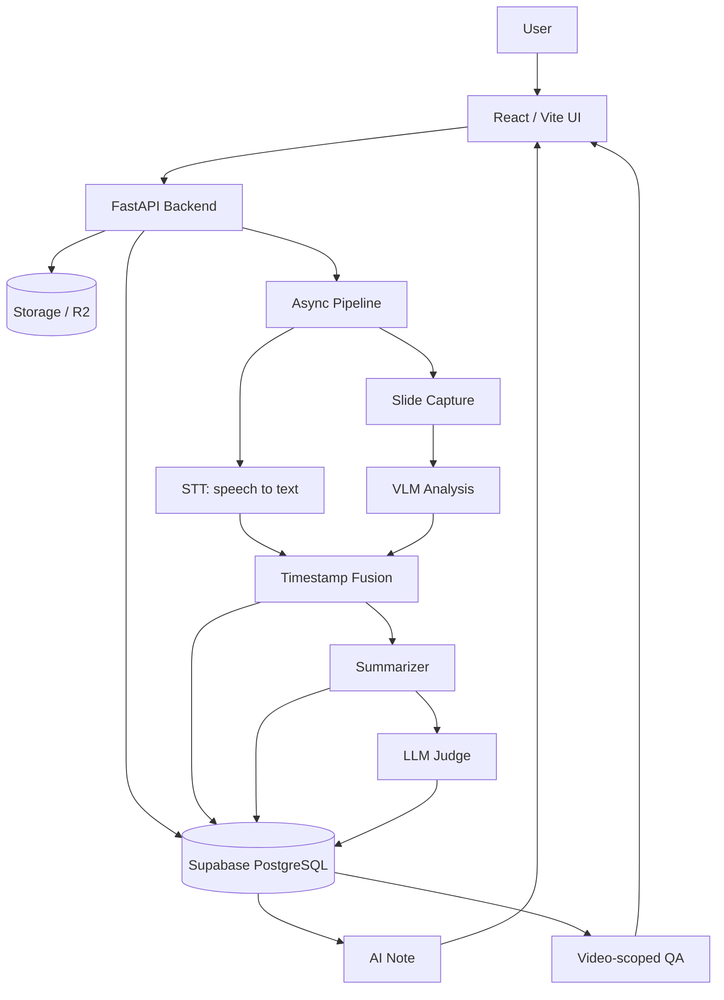
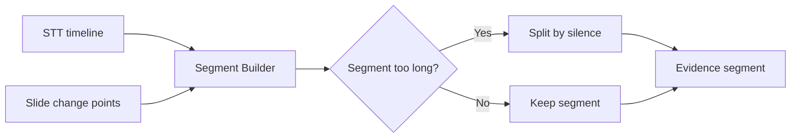

SeSAC:Note의 핵심 구조는 `영상 -> 음성 근거 + 화면 근거 -> 시간축 결합 -> 노트와 QA`입니다. 이 구조를 만들기 위해 STT, 슬라이드 캡처, VLM, Fusion, Summarizer, Judge, QA 흐름을 하나의 서비스 파이프라인으로 연결했습니다.

## 전체 처리 흐름

전체 흐름은 아래처럼 볼 수 있습니다.

사용자는 프론트엔드에서 영상을 업로드합니다. 백엔드는 영상 파일과 메타데이터를 저장하고, 비동기 파이프라인을 시작합니다. 파이프라인은 음성과 화면을 별도로 분석한 뒤 timestamp 기준으로 결합합니다. 결과는 DB에 저장되고, 사용자는 처리 상태, 요약, 근거, 챗봇 답변을 조회합니다.

서비스 구성도와 처리 단계

## STT: 음성 설명과 timestamp 생성

음성 설명을 화면과 연결하기 위해 STT 결과에 시간 정보를 함께 저장했습니다. 엔진 선택과 오디오 전처리의 구현은 다음과 같습니다.



<strong>Audio Engine: </strong><code>clova_stt.py</code><strong> &amp; </strong><code>whisper_stt.py</code>

<ul>
<li><strong>Clova Speech Client</strong>: 한국어 전문용어 및 긴 문장 인식률이 뛰어난 Naver Clova Speech API를 메인 엔진으로 사용</li>
<li><strong>Whisper Client</strong>: 비용 절감 및 로컬 테스트, 다국어 지원을 위해 OpenAI Whisper 모델(base/small 등)을 서브/백업 엔진으로 구현</li>
</ul>

<strong>Output Schema</strong>:

<pre><code>{
&quot;segments&quot;: [
{
&quot;id&quot;: &quot;stt_001&quot;,
&quot;start_ms&quot;: 0,
&quot;end_ms&quot;: 4500,
&quot;text&quot;: &quot;안녕하세요, 이번 강의에서는 변분 추론에 대해 알아보겠습니다.&quot;,
&quot;confidence&quot;: 0.985
},
...
],
&quot;confidence&quot;: 0.988,
&quot;raw_response&quot;: { ... } // (Optional) Clova/Whisper 원본 응답
}
</code></pre>

<table>
<tr><th><strong>지표</strong></th><th><strong>Clova</strong></th><th><strong>Whisper</strong></th><th><strong>승자</strong></th></tr>
<tr><td><strong>WER (단어 오류율)</strong></td><td>6.2%</td><td>45.4%</td><td>Clova (<strong>7배 좋음</strong>)</td></tr>
<tr><td><strong>CER (글자 오류율)</strong></td><td>4.0%</td><td>26.7%</td><td>Clova (<strong>7배 좋음</strong>)</td></tr>
<tr><td><strong>속도 (latency)</strong></td><td>10초</td><td>16초</td><td>Clova (<strong>1.6배 빠름</strong>)</td></tr>
</table>

<strong>Audio Routing </strong><code>stt_router.py</code>

<ul>
<li>설정 파일 기반으 코드 수정 없이 STT 엔진을 즉시 교체할 수 있는 <strong>Router Pattern</strong> 적용</li>
<li>오디오 추출부터 설정 파일을 통해서 결정된 backend(Clova/Whispeer)로 STT추출을 진행까지의 과정을 하나의 라우팅 레이어에서 관리</li>
<li>오디오 추출 로직을 분리하여, 오디오 파일만으로도 독립 실행 가능한 형태로 구성</li>
</ul>

<strong>Smart Audio Extraction (</strong><code>extract_audio.py</code><strong>)</strong>:

<ul>
<li><strong>Phase Cancellation Fix</strong>: 스테레오 오디오의 역상 상쇄 문제를 해결하기 위해 <code>volumedetect</code> 기반으로 Left/Right/Downmix/Phase-fix 중 최적의 모노 변환 방식을 자동으로 선택</li>
<li><strong>Multi-Format Support</strong>: 스토리지 용량 최적화 및 다양한 업로드 요건 충족을 위해 WAV, FLAC 뿐만 아니라 <strong>MP3 (128k)</strong> 인코딩을 기본 지원</li>
</ul>

<strong>최종 정리</strong>

<ol>
<li><strong>유연성 (Flexibility)</strong>: Router 도입으로 Clova(고성능)와 Whisper(무료/로컬)를 자유롭게 오가며 운영 가능하며, 설정 파일을 통해 손쉽게 제어 가능</li>
<li><strong>안정성 (Stability)</strong>: 역상 문제 자동 해결 로직(<code>auto-mono</code>)과 표준화된 출력 스키마를 통해 예측 가능한 파이프라인 구축</li>
<li><strong>효율성 (Efficiency)</strong>: MP3 압축을 통한 업로드 용량 절감 및 처리 속도 최적화</li>
</ol>

<strong>시도해 본 것들</strong>

<ul>
<li><strong>Whisper 모델 최적화</strong>: V100 환경에서 Whisper Base 모델 서빙을 시도했으나, 한국어 전문용어 인식률 대비 속도(RTF)가 Clova API에 비해 현저히 떨어져 메인 서비스에는 Clova를 채택함 (벤치마크: Clova WER 6% vs Whisper 45%)</li>
<li><strong>Faster-Whisper</strong>: 속도 개선을 위해 CTranslate2 기반의 faster-whisper 도입을 검토했으나, 여전히 클라우드 API의 편의성과 정확도를 넘어서지 못해 보류</li>
</ul>



## Capture: 의미 있는 화면 변화 추출

화면은 매 프레임을 저장하면 안 된다. 중복 이미지가 많아지고, VLM 호출 비용과 처리 시간이 늘어난다. 그래서 캡처 단계의 목표는 모든 화면을 저장하는 것이 아니라 학습에 의미 있는 변화만 골라내는 것이다.

이 프로젝트의 캡처 흐름은 dHash, ORB, pHash+ORB, Smart ROI, adaptive resize 같은 개선을 거치며 발전했다. 자세한 개선 과정은 별도 글에서 다룬다.

## VLM: 슬라이드 정보를 구조화

캡처된 슬라이드는 VLM 분석으로 넘어간다. VLM은 화면 속 텍스트, 수식, 표, 도표, 코드, 레이아웃 정보를 구조화한다. 이 단계의 출력 품질이 낮으면 이후 요약 품질도 낮아진다.

따라서 VLM prompt는 단순 설명문을 얻기보다 요약에 쓰기 좋은 구조를 만드는 방향으로 설계했다. 핵심 내용과 보조 정보, 시각 근거를 분리하면 downstream LLM이 불필요한 정보를 덜 섞어 쓰게 된다.

## Fusion: STT와 VLM을 segment로 결합

Fusion은 이 프로젝트의 중심이다. STT와 VLM은 서로 다른 modality에서 온다. 하나는 음성 설명이고, 하나는 화면 근거다. 두 결과를 timestamp 기준으로 묶어야 비로소 "이 시간대에 어떤 화면을 보며 어떤 설명을 들었는가"를 알 수 있다.

Fusion 결과는 segment 단위로 정리된다.

| segment 구성 요소 | 의미 |
| --- | --- |
| 시간 범위 | 해당 설명과 화면이 연결되는 구간 |
| STT text | 강사의 음성 설명 |
| VLM output | 슬라이드의 시각 정보 |
| evidence | 요약과 QA가 참조할 근거 |

이 segment는 Summarizer, Judge, QA가 공유하는 근거 단위가 된다.

Fusion은 2단계 분할 문제로 볼 수 있다. 1차로 화면 전환 시점을 기준으로 구간을 나누고, 구간이 너무 길어지면 2차로 STT의 침묵 구간을 찾아 다시 나눈다. 화면은 불연속적으로 바뀌고 음성은 연속적으로 흐르기 때문에, 두 기준을 함께 써야 segment가 너무 크거나 작게 쪼개지는 문제를 줄일 수 있다.

중복 슬라이드는 별도 문제였다. 같은 슬라이드가 여러 시간대에 다시 등장하면 이미지 파일 하나와 시간 구간 하나를 단순히 1:1로 묶기 어렵다. 그래서 캡처 결과에는 `time_ranges`처럼 하나의 캡처가 여러 시간 구간을 가질 수 있는 1:N 매핑이 필요했다.

| 구조 | 의미 |
| --- | --- |
| 단일 `start/end` | 한 캡처가 한 시간 구간에만 대응 |
| `time_ranges` | 같은 캡처가 여러 시간 구간에 재사용될 수 있음 |

이 구조가 있어야 VLM 결과를 병합할 때 같은 슬라이드를 중복 근거로 계속 넣지 않고, 실제 등장 구간만 펼쳐서 사용할 수 있다. 또한 summary item에는 어떤 VLM unit에서 온 정보인지 추적 가능한 근거를 남겨야 Judge와 QA가 "어디서 나온 설명인가"를 다시 확인할 수 있다.

## Summary, Judge, QA로 이어지는 downstream

Summarizer는 segment를 바탕으로 영상 없이 읽을 수 있는 노트를 생성한다. Judge는 생성된 노트를 원본 segment와 비교해 groundedness, note quality, multimodal use를 점검한다. QA는 전체 인터넷이나 임의 지식이 아니라 특정 영상의 summary, segment, evidence 안에서 답하도록 제한한다.

이렇게 downstream을 나눈 이유는 각 단계의 책임을 분리하기 위해서다. Summarizer는 노트를 만들고, Judge는 보조 평가를 하고, QA는 사용자의 질문에 영상 근거를 바탕으로 답한다.

## DB와 Storage에 남는 결과

서비스로 만들려면 결과가 파일 시스템에만 남아서는 안 된다. 프론트엔드가 조회할 수 있도록 처리 상태와 결과가 DB에 남아야 한다.

| 저장 대상 | 예시 |
| --- | --- |
| 영상 메타데이터 | videos |
| 처리 작업 상태 | jobs |
| 화면 캡처 | captures, time_ranges |
| STT 결과 | stt_results |
| 결합 근거 | segments, evidence |
| 요약 결과 | summaries, summary_results |
| 평가 결과 | judge |

Storage/R2 계열 저장소는 원본 영상과 캡처 이미지를 담당하고, Supabase PostgreSQL은 상태와 구조화 결과를 담당한다. 이 분리가 있어야 업로드, 진행률, 요약 조회, 영상별 QA가 웹 서비스 흐름으로 이어질 수 있다.

처리 상태는 `preprocessing_jobs`와 `processing_jobs`로, 시간축 결합과 요약 결과는 `fs_segments`와 `fs_summaries`로 구분했습니다.

Audio (src/audio) 개발 이력



<table>
<tr><th>Date</th><th>Change Bundle</th><th>Category</th><th>Evidence</th><th>Impact</th></tr>
<tr><td>12/31</td><td>Clova STT 클라이언트 초기 구현(요청/응답 정규화, 신뢰도 계산)</td><td>DevEx/Quality</td><td><code>5e18553</code></td><td>STT 메인 엔진 기반 확보</td></tr>
<tr><td>01/01</td><td>역상 스테레오 무음 해결: volumedetect 기반 auto-mono 선택(Left/Right/Downmix/Phase-fix)</td><td>Reliability</td><td><code>0e2760f</code></td><td>무음 케이스 자동 복구</td></tr>
<tr><td>01/02</td><td>Whisper 백업 엔진 도입 및 성능 비교</td><td>Cost/Quality</td><td><code>03e4a0d</code></td><td>WER: Clova 6% vs Whisper 45% → 메인 Clova 유지</td></tr>
<tr><td>01/14~01/15</td><td>Router Pattern + settings.yaml 분리 + 리팩토링(독립 실행 가능)</td><td>DevEx</td><td><code>d906e05</code></td><td>코드 수정 없이 STT 엔진/옵션 교체</td></tr>
<tr><td>01/20</td><td>STT 세그먼트에 고유 ID(stt_XXX) 부여(추적성 강화)</td><td>Reliability/QA</td><td><code>3098f59</code></td><td>이후 Summarizer 근거 참조 가능</td></tr>
<tr><td>01/21</td><td>MP3(128k)/FLAC 등 다중 포맷 지원 + DB 직동기화 최적화</td><td>Cost/Perf</td><td><code>8e77ee6</code></td><td>저장/업로드 비용 절감, 운영 유연성 증가</td></tr>
</table>



## 다음 글로 이어지는 지점

이 구조에서 가장 먼저 병목이 드러난 곳은 화면 캡처와 VLM 입력이었다. 중복 슬라이드가 많으면 VLM 호출이 늘고, VLM 출력이 흔들리면 요약과 Judge까지 흔들린다. 다음 글에서는 이 부분을 어떻게 줄였는지 정리한다.

- 이전 글: [04. 문제 정의: STT 요약을 넘어 독립형 강의 노트로]()
- 다음 글: [06. 캡처와 VLM 개선: 중복 슬라이드와 입력 품질 다루기]()
