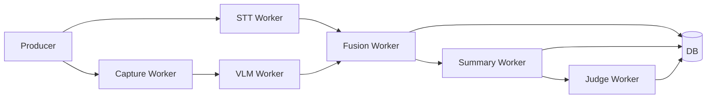

강의 영상 분석은 짧은 API 요청처럼 끝나지 않습니다. STT, 캡처, VLM, Fusion, Summary, Judge가 순서대로 또는 병렬로 실행되고, 각 단계마다 외부 모델 호출과 저장이 발생합니다. 사용자는 이 긴 과정을 기다려야 합니다.

SeSAC:Note에서 긴 영상 처리는 파이프라인 설계의 핵심 병목이었습니다. 이 글에서는 병목을 어떻게 나누고, 상태 추적과 체감 대기시간을 어떻게 다뤘는지 정리합니다.

## 긴 영상 처리의 문제

긴 영상 처리에서 문제는 단순히 "느리다"가 아닙니다. 서비스 관점에서는 다음 문제가 동시에 생깁니다.

| 문제 | 서비스 영향 |
| --- | --- |
| 단계별 처리 시간이 다름 | 사용자가 현재 상태를 알기 어려움 |
| 중간 실패 가능성 | 어디까지 성공했는지 추적 필요 |
| 외부 모델 호출 많음 | rate limit과 retry 고려 필요 |
| 결과가 늦게 나옴 | 사용자가 기다림을 포기할 수 있음 |
| DB와 파일 결과가 분리됨 | 프론트엔드에서 결과 조회가 어려움 |

초기 구조에서는 STT와 캡처처럼 독립적인 작업도 직렬로 처리되기 쉬웠습니다. 이러면 앞단에서부터 대기 시간이 쌓입니다.

파이프라인 버전별 개선 과정



<strong>v1.0 Baseline E2E + 모듈화 기반 (2025-12-30 ~ 2026-01-07)</strong>

<strong>목표</strong>

<ul>
<li>End-to-End 파이프라인 검증(업로드 → STT/캡처 → VLM → 요약 → 결과)</li>
<li>최적화를 위한 모듈 간 인터페이스 및 데이터 스키마 설계</li>
</ul>

<strong>핵심 변경</strong>

<ul>
<li>STT: Clova Speech 기반 인터페이스 구현 및 응답 정규화, 신뢰도 산출 로직 적용</li>
<li>Capture: 화면 전환 중심의 슬라이드 추출 로직 설계</li>
<li>Judge: 평가 지표(근거성, 품질, 준수도) 수립 및 자동화 평가를 위한 기반 마련(01/07)</li>
</ul>

<strong>결과</strong>

<ul>
<li>End-to-End 동작은 확인했지만, 토큰 낭비 및 병목 이슈가 발생한다는 개선점 확인</li>
</ul>

<strong>v2.0 Batch 처리 및 QA Loop 도입 (2026-01-08 ~ 2026-01-16)</strong>

<strong>목표</strong>

<ul>
<li>긴 영상 처리 시 발생하는 메모리 및 토큰 제한 문제를 해결</li>
<li>자동화된 품질 관리(Judge Loop)를 통해 시스템의 재현성과 신뢰도를 확보하는 데 집중</li>
</ul>

<strong>핵심 변경</strong>

<ul>
<li>Orchestration: 전처리(Pre-ADK)와 실행(ADK Pipeline) 단계를 분리(01/08)</li>
<li>QA: Judge Judge 평가 모듈을 파이프라인에 연동, 기준에 미달하는 결과물은 피드백 루프를 통해 자동으로 재생성되는 로직 구현(01/09~01/16,  <code>c64f53c</code>)</li>
<li>Batch: 긴 영상을 N 단위로 쪼개 처리하는 Batch Mode 도입(01/12, Issue #63)</li>
<li>리팩토링: config파일로 각 모듈 프롬프트, 설정 가능하게 구조 개선</li>
</ul>

<strong>결과</strong>

<ul>
<li>Judge 도입으로 품질 미달 시 스스로 교정하는 구조를 완성</li>
<li>Batch처리 과정에서 동일 프롬프트 중복 전달로 토큰이 크게 증가하는 문제가 발생하여 v2.1에서 프롬프트 최적화로 해결</li>
</ul>

<strong>v2.1 토큰 및 지연시간(Latency) 최적화 (2026-01-13 ~ 2026-01-24)</strong>

<strong>목표</strong>

<ul>
<li>서비스 품질은 유지하면서, 비용과 직결되는 LLM 입력 토큰 및 응답 속도를 구조적으로 개선하는 데 집중</li>
</ul>

<strong>핵심 변경</strong>

<ul>
<li>API key를 여러 개 적용하여 Round-robin 형태가 되도록 함(01/15, <code>5ae8b1d</code>)</li>
<li>Summarizer 프롬프트 영문화 및 중복 제거, 기술 용어는 영어로 출력하도록 변경. 입력 및 출력 토큰 절감(01/19, PR #97, <code>021f12c</code>)</li>
<li>출력 포맷/입력 포맷 실험: JSON → JSONL, 한글 → 영어 전환 실험(Issue #134)</li>
<li>VLM 프롬프트 안정화: 환각 문제(표 행/열, 객체 오인식 등) 개선 및 LaTeX/특수 포맷 금지로 후처리 안정성 개선(01/17, Issue #76)</li>
<li>VLM 프롬프트 최적화: VLM 프롬프트 영문화로 입력 토큰 절감(01/22~01/23, PR #115)</li>
<li>Judge 프롬프트 최적화(Issue #91)</li>
<li>Judge 최적 배치 수 실험(Issue #95)</li>
</ul>

<strong>결과</strong>

<ul>
<li>Summarizer 입력 토큰(6분 기준): 9065 → 5396 (약 -40.5%)</li>
<li>Summarizer latency: 45초 → 17.9초 (약 -60.2%)</li>
<li>VLM 토큰(장당): 1077 → 1005 (약 -6.7%)</li>
<li>토큰 절감 실험 결과(부분): JSON→JSONL(약 -4.5%), 한글→영어 단순 전환(약 -7.5%)</li>
</ul>

<strong>v3.0 서비스 아키텍처 고도화 및 운영 안정화(Cloud Sync, Parallel, Provider) (2026-01-20 ~ 2026-01-29)</strong>

<strong>목표</strong>

<ul>
<li>로컬 실행 중심에서 벗어나 클라우드 기반의 비동기 처리 구조를 확립</li>
<li>외부 API 의존성 리스크(한도/병목)를 운영 가능 수준으로 개선</li>
<li>전처리 병렬화로 처리 시간 개선</li>
</ul>

<strong>핵심 변경</strong>

<ul>
<li>Data/Infra: Supabase Storage 연동 및 단계별 스트리밍 업로드 도입(01/20~01/22)</li>
<li>Preprocess 개별적으로 수행되던 STT와 Capture 과정을 병렬화하여 전체 전처리 시간을 단축(01/25~01/29)</li>
<li>병목 현상이 잦은 기존 Provider를 Alibaba Cloud로 전환(PR #137, 01/29)</li>
<li>Orchestration: ADK 처리 시간 병목으로 ADK → LangGraph 전환 결정(01/25, Issue #117) 및 PR merge(01/27, PR #125)</li>
</ul>

<strong>결과</strong>

<ul>
<li>전처리 시간: 15.1s → 9.0s (약 -40%)</li>
<li>캡처 중복/비용 최적화: 중복 캡처 수 11→5(-55%), VLM 호출(예시) 6→3(-50%)</li>
</ul>



## STT와 capture 직렬 실행 병목

STT와 화면 캡처는 서로 독립적인 작업입니다. 음성을 텍스트로 바꾸는 일과 화면 변화를 찾는 일은 동시에 진행할 수 있습니다. 그런데 직렬로 실행하면 STT가 끝난 뒤 캡처가 시작되거나, 반대로 캡처가 끝난 뒤 STT가 시작됩니다.

프로젝트 기록 기준으로 전처리 단계에서 다음 개선이 정리되어 있다.

| 버전 | 구조 | 기록된 처리 시간 | 해석 |
| --- | --- | --- | --- |
| v1 | 직렬 전처리 | 15.1초 | STT와 캡처 대기 발생 |
| v2 | asyncio 병렬 전처리 | 9.0초 | 독립 작업을 동시에 실행 |

이 수치는 해당 실험 조건의 전처리 결과다. 중요한 점은 수치 자체보다 병목을 보는 방식이다. 서로 독립적인 단계는 worker로 분리하고, 의존성이 있는 단계만 순서를 유지한다.

## worker 분리와 asyncio 병렬화

비동기 파이프라인은 단계별 책임을 나누는 방식으로 정리됐다.

Producer는 작업을 만들고, 각 worker는 자신이 맡은 단계를 처리한다. 외부 모델 호출에는 rate limit이 있으므로 동시성을 무제한으로 늘릴 수는 없다. 세마포어 같은 제한 장치를 두면 동시 실행과 호출 안정성 사이의 균형을 잡을 수 있다.

개발 기록에는 30분 강의 기준 전체 파이프라인 시간이 3분 32초에서 1분 57초로 줄어든 흐름이 정리되어 있다. 이 역시 특정 조건의 결과이며, 영상 길이, 캡처 수, 외부 모델 응답 속도에 따라 달라질 수 있다.

v2.1 단계에서는 prompt와 출력 형식을 다듬어 입력 토큰을 약 12% 줄인 기록도 정리되어 있다. 이 수치는 프로젝트 기록 기준이며, 전체 비용 절감을 보장하는 값이 아니라 prompt compacting이 병목 완화에 기여할 수 있음을 보여주는 제한된 근거로 봐야 한다.

## batch 단위 처리와 첫 결과 노출



<h4 id="opt-17"><strong>문제 정의</strong></h4>

VLM 필터링 도입으로 텍스트 중심의 케이스는 처리 시간이 크게 줄었지만 이미지와 도표 비중이 높은 실제 강의 PPT의 특성상 전체 파이프라인의 평균 처리 시간은 기대만큼 줄어들지 않았습니다. 모델 변경, 병렬 처리, 프롬프트 최적화 등 가용 가능한 모든 수단을 동원했음에도 6분 영상 기준 약 2분 30초의 대기 시간으로 사용자 이탈이 우려되었습니다.

<h4 id="opt-18"><strong>접근 방법</strong></h4>

배치 단위로 처리하고 결과를 바로 출력해준다면 사용자가 첫 응답을 받는데까지 걸리는 시간을 줄임으로써 체감 대기시간을 크게 개선할 수 있다고 판단했습니다. 따라서 전체 요약 방식에서 배치 단위 처리 + 스트리밍 방식으로 파이프라인을 변경했습니다.

<h4 id="opt-19"><strong>해결</strong></h4>
<ul>
<li>입력을 배치로 분할</li>
<li>배치가 들어오는 즉시 배치 단위로 파이프라인 실행:<ul>
<li>VLM → 요약 → Judge</li>
</ul>
</li>
<li>배치 결과가 생성되는 즉시 사용자에게 전달</li>
</ul>
<h4 id="opt-20"><strong>결과</strong></h4>
<ul>
<li>6분 영상 기준 첫 응답까지 지연시간 2분 30초 → 30초로 80% 감소</li>
<li>전체 결과가 나오기 전에 앞부분 결과를 먼저 확인할 수 있어, 사용자의 체감 대기시간을 줄이는 방향으로 UX 개선</li>
</ul>



batch 구조에서 중요한 점은 앞부분을 먼저 보여주는 것만이 아니다. 긴 영상을 여러 batch로 자르면 뒤쪽 batch가 앞쪽 내용을 잊을 수 있다. 그래서 이전 batch의 요약 claim을 `batch_context`에 누적하고, 다음 batch prompt에 `previous_context`로 전달하는 방식이 필요했다.

| batch 처리 요소 | 역할 |
| --- | --- |
| batch size | 한 번에 처리할 캡처 묶음 크기 |
| current batch | 현재 처리 중인 batch index |
| completed batches | 완료된 batch 목록 |
| previous context | 앞 batch에서 추출한 핵심 claim |
| final merge | batch별 결과를 다시 하나의 노트로 병합 |

이 구조는 긴 영상 전체를 한 번에 LLM에 넣는 방식보다 context 크기를 관리하기 쉽다. 대신 batch 사이의 연결이 약해질 수 있으므로, 이전 batch의 핵심 맥락을 다음 batch로 넘기는 장치가 필요했다.

## DB 상태 동기화와 resume

비동기 처리는 빠를 수 있지만, 상태가 DB에 안정적으로 남지 않으면 서비스에서 쓰기 어렵다. 프론트엔드는 "지금 처리 중인지", "어느 단계까지 끝났는지", "중간 결과가 있는지"를 API로 확인해야 한다.

그래서 jobs와 videos 계열 상태, STT 결과, captures, segments, summaries, judge 결과를 DB에 저장하는 흐름이 중요했다. 중간 결과가 남아 있으면 실패 후 resume을 설계할 수 있고, 사용자는 완성된 일부 결과를 먼저 볼 수 있다.

v3 구조에서는 단계별 산출물을 DB에 실시간으로 남기는 방향이 강조됐다. 전처리, VLM, Fusion, Summary, Judge 결과가 각자 저장되면 프론트엔드는 "완료/실패"만 보는 것이 아니라 어느 단계까지 도달했는지 확인할 수 있다.

외부 API 호출 안정성도 별도 설계 대상이었다. 특정 호출 경로에 문제가 생겨도 전체 처리가 바로 중단되지 않도록 round-robin 방식의 key routing을 도입한 흐름이 정리됐다. 이는 외부 API 의존성을 낮추기 위한 장애 완화 설계로 볼 수 있다.

## SSE로 사용자에게 진행 상태 전달

상태 조회는 polling으로도 가능하지만, 긴 작업에서는 SSE가 더 자연스럽다. SSE는 서버가 진행 상태를 이벤트로 보내고, 프론트엔드는 이를 받아 UI를 갱신한다.

SeSAC:Note에서 SSE는 "처리가 빠르다"는 주장을 위한 장치가 아니다. 긴 처리가 있음을 인정하고, 사용자가 현재 상태를 이해할 수 있게 만드는 UX 장치다.

## 배치 크기별 실행 시간과 토큰 사용량

아래는 8개 세그먼트의 전체 요약 실행 시간을 비교한 실험입니다. 앞 절의 첫 응답 지연과는 측정 구간이 다릅니다. 50.52초·입력 26,889토큰은 배치 크기 2이며, 배치 크기 4는 76.62초·입력 18,575토큰입니다. 모델별 비용 표는 실험 당시의 가격 가정입니다. 계획과 실행 결과는 당시의 순서로 남겼습니다.



### [Experiment] Summarizer Batch Size 성능 벤치마크

### 목적
Summarizer의 배치 크기(batch size)에 따른 성능(시간, 토큰 사용량)과 출력 품질을 비교하여 향후 Progressive Pipeline 설계에 참고할 데이터를 확보한다.

### 배경
현재 Summarizer는 모든 세그먼트를 하나의 거대한 프롬프트에 담아 **Single Call**로 처리하고 있음.
- **문제점:** 영상이 길어지면 입력 토큰이 급증, Latency 악화, 단일 실패 시 전체 실패 위험.
- **향후 계획:** Progressive Pipeline (예: 2 segments씩 VLM → Sync → Summary → Judge 반복)으로 전환 예정.
- **실험 목적:** 배치 크기별 성능 특성을 파악하여 Progressive 설계 시 최적 chunk size 결정에 활용.

### 실험 설계

### 테스트 데이터
- `segments_units.jsonl` (8 segments 기준)

### 배치 크기 조건
| Batch Size | 호출 횟수 (8 seg 기준) |
|:----------:|:----------------------:|
| 1          | 8                      |
| 2          | 4                      |
| 4          | 2                      |
| 8 (전체)   | 1                      |

### 측정 지표
1. **시간 (Latency)**
   - 전체 실행 시간 (초)
   - 호출당 평균 시간
2. **토큰 사용량**
   - 입력 토큰 (Input Tokens)
   - 출력 토큰 (Output Tokens, 가능하면)
   - 총 토큰
3. **출력 품질**
   - 생성된 `segment_summaries.jsonl` 저장
   - Judge 점수 비교 (선택적)

### 구현 방향
1. **벤치마크 스크립트 생성** (`scripts/benchmark_summarizer.py` 또는 유사 경로)
   - 기존 `summarizer.py` 로직을 재활용하되, 배치 크기를 파라미터로 받음.
   - 각 조건별 결과를 별도 디렉토리/파일로 저장.
2. **결과 리포트 생성**
   - JSON 또는 Markdown 형태로 비교표 출력.

### Acceptance Criteria
- [x] 벤치마크 스크립트 작성 완료
- [x] Batch Size 1, 2, 4, 8 조건별 실행 완료
- [x] 시간/토큰 사용량 비교표 작성
- [x] 결과 요약 및 향후 권장 사항 문서화

### 비고
- 프로덕션 코드(`summarizer.py`)는 변경하지 않음 (추후 Progressive Pipeline 전환 시 별도 작업).
- 이 실험은 아키텍처 의사결정을 위한 데이터 수집 목적.

---

### 추가 실험 기록 1

### Summarizer Batch Size Benchmark 결과 보고

**실험 조건**
- **데이터**: 8 segments (`test4_Diffusion`)
- **모델**: `gemini-3-flash-preview`
- **환경**: `max-workers=4`, `request-interval=2.0s` (API Rate Limit 방지를 위한 Throttling 적용)

### 1. 결과 요약 (Baseline: Batch 8)

| Batch Size | Latency (s) | vs Batch 8 (%) | Input Tokens | vs Batch 8 (%) | 비고 |
|:---:|:---:|:---:|:---:|:---:|:---|
| 1 | 341.00 | +310% 🔺 | 43,517 | +202% 🔺 | ⚠️ **비권장** (API 불안정, 비용↑) |
| **2** | **50.52** | **-39.2%** ⬇️ | 26,889 | +86.5% 🔺 | 🏆 **최고 속도** |
| 4 | 76.62 | -7.8% ⬇️ | 18,575 | +28.8% 🔺 | ✅ **비용/속도 균형** |
| 8 | 83.13 | - | 14,418 | - | Baseline |

### 2. 결론 및 제안

1.  **Batch 1 (세그먼트 단위 병렬화) 지양**
    - **Context 손실 위험**: 개별 세그먼트 처리 시 앞뒤 문맥 파악이 어려워 품질 저하 우려.
    - **API 불안정성**: 과도한 호출로 Rate Limit(429) 및 재시도 지연 발생.
    - **토큰 비용 폭증**: 기본 프롬프트 중복으로 Input Token이 3배(+202%) 증가.

2.  **프로그레시브 파이프라인 전략**
    - **Batch 2~4 권장**: 2~4개 세그먼트를 묶어서 처리하는 것이 속도와 안정성 면에서 최적.
      - **속도 중시**: Batch 2 (Latency 39% 감소)
      - **비용 효율 중시**: Batch 4 (Latency 8% 감소, 토큰 증가폭 합리적)
    - **프롬프트 최적화 필요**: 배치를 쪼갤수록 시스템 프롬프트(System Instruction) 비용이 중복 발생하므로, 프롬프트 경량화가 시급함.

---

### 추가 실험 기록 2

### Benchmark Comparison: Gemini 3 Flash vs Gemini 2.5 Flash

### 실험 조건
- **데이터**: 8 segments (test4_Diffusion)
- **환경**: max-workers=4, request-interval=2.0s (Throttling 적용)

### 1. 모델별 성능 요약 (Batch 2 기준)

| Metric | Gemini 3 Flash | Gemini 2.5 Flash | 차이 |
| :--- | :--- | :--- | :--- |
| **Latency (s)** | 50.52s | 54.35s | 3 Flash가 소폭 빠름 (-7%) |
| **Output Tokens** | 10,811 | 17,631 | 2.5 Flash가 훨씬 수다스러움 (+63%) |
| **TPS (Tokens/sec)** | ~214 | ~324 | 2.5 Flash가 생성 속도는 압도적 (+51%) |

### 2. 비용 분석 (8 Segments 추정치)

| Model | Token Pricing (In/Out) | Total Cost | 비율 |
| :--- | :--- | :--- | :--- |
| **Gemini 3 Flash** | $0.50 / $3.00 | $0.0458 | 100% |
| **Gemini 2.5 Flash** | $0.10 / $0.40 | $0.0096 | ~21% (1/5 수준) |

### 3. 결론: Trade-off 분석

두 모델은 명확한 장단점을 가지고 있습니다.

### Cost & Throughput (Gemini 2.5 Flash)
*   **장점**: 압도적인 가성비(비용 80% 절감)와 빠른 생성 속도(TPS).
*   **특성**: 요약문이 매우 길고 상세하게 생성됨(Verbose).

### Latency & Conciseness (Gemini 3 Flash)
*   **장점**: 응답 완료 시간(Latency)이 가장 빠르고, 결과물이 간결함.
*   **단점**: 상대적으로 높은 비용.

> (관련 논의: #31)

---



Fusion & Summarizer (src/fusion) 개발 이력



<table>
<tr><th>Date</th><th>Change Bundle</th><th>Category</th><th>Evidence</th><th>Impact</th></tr>
<tr><td>12/31</td><td>초기 Sync 및 Summarizer 구성</td><td>-</td><td><strong>PR #14</strong><strong> / </strong><code>708820a</code></td><td>-</td></tr>
<tr><td>01/05</td><td>요약이 과도하게 간결 → 프롬프트 보강 1차</td><td>Quality</td><td><strong>Issue #19</strong><strong> / </strong><code>c083ae7</code></td><td>노트 독립성 개선 방향 확보</td></tr>
<tr><td>01/12~01/13</td><td>Batch 처리 도입(긴 영상)</td><td>Perf</td><td><strong>Issue #63</strong><strong> /
</strong><strong>PR #65</strong></td><td>메모리 한계 극복</td></tr>
<tr><td>01/12~01/13</td><td>문맥 연속성(Context chaining) </td><td>Quality</td><td><strong>Issue #63</strong><strong> /
</strong><strong>PR #65</strong></td><td>배치 경계 맥락 연결성</td></tr>
<tr><td>01/13</td><td>프롬프트 압축(7000자→700자)</td><td>Cost/Perf</td><td><strong>Issue #64</strong></td><td>토큰/타임아웃 리스크 감소</td></tr>
<tr><td>01/19</td><td>Summarizer &amp; Judge 배치 기반 최적 조합 찾기/재시도 최적화</td><td>Quality/Reliability</td><td><strong>Issue #91</strong><strong>/</strong><strong>#95</strong></td><td>세그먼트 품질 안정화</td></tr>
<tr><td>01/22~01/23</td><td>영어화 + 용어 영어 유지</td><td>Cost/Perf</td><td><strong>PR #97</strong></td><td>입력 토큰 -40.5%, latency -60.2%</td></tr>
<tr><td>상시</td><td>근거 기반 요약 강제(source_type, evidence_refs) + 스키마 검증/재생성</td><td>Reliability/QA</td><td><code>cb50044</code></td><td>결과 추적성과 재현성 확보</td></tr>
</table>



## 처리 시간과 첫 응답 지연의 구분

전처리 시간, 전체 파이프라인 완료 시간, 첫 응답 지연은 측정 시작점과 끝점이 다릅니다. 외부 모델 응답, 영상 길이, 캡처 수, 네트워크와 저장소 상태도 달라질 수 있으므로 서로 다른 조건의 수치를 하나의 개선율로 합치지 않습니다.

비동기 구조에서 정리한 핵심은 독립 작업의 병렬 실행, 단계별 상태 저장, 완료된 결과의 순차 노출입니다. 배치 크기별 비교와 첫 응답 개선 결과도 이 글에 함께 정리하되, 각 실험의 측정 구간을 구분했습니다.

다음 글에서는 이렇게 만들어진 summary, segment, evidence를 사용자가 질문할 수 있는 QA 흐름으로 어떻게 연결했는지 정리한다.

- 이전 글: [06. 캡처와 VLM 개선: 중복 슬라이드와 입력 품질 다루기]()
- 다음 글: [08. QA 설계: 영상 근거 안에서만 답하게 만들기]()
