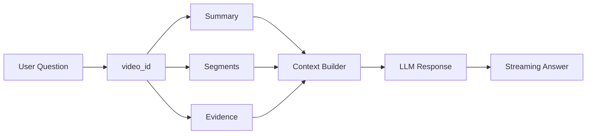

SeSAC:Note의 QA는 범용 챗봇을 붙이는 문제가 아니었습니다. 사용자가 기대하는 것은 "아무 지식이나 답하는 AI"가 아니라 "내가 올린 이 강의 영상의 근거 안에서 답하는 AI"였습니다.

그래서 이 글에서는 QA 흐름을 `video-scoped evidence-grounded QA`로 정리합니다. 일반적인 vector DB RAG 전체를 구현했다고 표현하지 않고, 특정 영상의 summary, segment, evidence 안에서 답변하는 QA 흐름으로 제한합니다.

## 단순 LLM QA의 문제

가장 간단한 방식은 사용자의 질문을 LLM에 그대로 넣는 것입니다. 하지만 이 방식은 강의 복습 서비스에 맞지 않습니다.

| 단순 LLM QA 문제 | 영향 |
| --- | --- |
| 영상 근거를 모름 | 강의에서 다룬 내용인지 확인하기 어려움 |
| 답변 범위가 넓음 | 일반 지식 답변으로 흐를 수 있음 |
| 출처 추적이 약함 | 어떤 segment에서 나온 답인지 알기 어려움 |
| 긴 요약 전체 주입 | 토큰 비용과 latency 증가 |

강의 영상 기반 QA에서는 답변보다 먼저 범위를 제한해야 합니다. 이 질문은 어떤 영상에 대한 것인지, 어떤 segment가 관련되는지, 어떤 summary와 evidence를 근거로 삼을지 정해야 합니다.

## video_id 기준 context 제한

QA 흐름의 기본 단위는 `video_id`입니다. 사용자가 질문하면 시스템은 전체 데이터가 아니라 해당 영상의 summary, segment, evidence를 기준으로 context를 구성합니다.

이 구조의 목적은 답변을 좁히는 것입니다. "이 영상에서는 무엇을 설명했는가"에 답하게 만들고, 외부 지식으로 과하게 확장되는 것을 줄입니다.

## Flash Mode와 Thinking Mode

QA 설계에서 중요한 구분은 Flash Mode와 Thinking Mode다. 둘은 답변 속도와 근거 탐색 깊이를 다르게 가져가는 흐름이다.

| 모드 | 사용하는 근거 | 적합한 질문 | 주의점 |
| --- | --- | --- | --- |
| Flash Mode | 생성된 노트와 요약 중심 | 빠른 개념 확인, 간단한 복습 질문 | 요약에 근거가 부족하면 답변이 얕아질 수 있음 |
| Thinking Mode | 요약 + STT/VLM 근거 재탐색 | 복잡한 설명, 수식/화면 맥락이 필요한 질문 | latency와 토큰 비용이 커질 수 있음 |

Flash Mode는 사용자가 빠르게 확인하고 싶은 질문에 적합하다. Thinking Mode는 요약만으로 근거가 부족할 때 STT와 VLM 정보를 다시 찾아, 영상 안의 근거를 더 넓게 확인한 뒤 답변하는 흐름에 가깝다.

이 구분은 "더 강한 Agent"를 만들었다는 뜻이 아니다. 같은 영상 근거 안에서도 질문 난도에 따라 context를 얕게 볼지, 더 깊게 다시 볼지를 나눈 설계다.

## summary, segment, evidence를 답변 근거로 쓰는 방식

QA context는 하나의 텍스트 덩어리가 아니다. 역할이 다른 정보를 묶어야 한다.

| context 요소 | 역할 |
| --- | --- |
| summary | 강의 내용을 읽기 쉬운 노트로 정리한 결과 |
| segment | timestamp 기준으로 묶인 음성+화면 근거 |
| evidence | 답변이 참조할 수 있는 원본 근거 |
| video metadata | 어떤 영상에 대한 질문인지 제한 |

이 구조에서는 답변이 영상 밖으로 나가면 안 된다. 필요한 경우 "이 영상의 근거만으로는 확인하기 어렵다"는 답변도 가능해야 한다.

답변에는 참고한 슬라이드나 음성 구간을 함께 제시하는 편이 좋다. 사용자가 답을 읽고 끝내는 것이 아니라, 필요하면 어느 화면과 어느 설명 구간에서 나온 답인지 되돌아갈 수 있어야 하기 때문이다.

## LangGraph를 쓴 이유

LangGraph는 대화 흐름을 상태 기반으로 구성하기 위해 사용했다. QA는 단순히 `question -> answer`가 아니다. 세션, 영상 범위, 이전 질문, context 구성, 답변 streaming, 후속 질문 제안이 함께 움직인다.

LangGraph를 사용하면 다음 책임을 분리할 수 있다.

| 책임 | 설명 |
| --- | --- |
| state 관리 | 현재 video_id, 대화 기록, context 상태 유지 |
| context 구성 | summary, segment, evidence를 질문에 맞게 조합 |
| response 생성 | 영상 근거 안에서 답변 생성 |
| follow-up | 사용자가 이어서 물을 만한 질문 제안 |

여기서 중요한 것은 LangGraph라는 도구 자체가 아니다. 중요한 것은 QA를 영상 근거와 상태 흐름 안에 묶었다는 점이다.

상태 기반 흐름으로 나누면 질문 파싱, 근거 선택, 부족한 근거 보강, 답변 생성 책임을 분리할 수 있다. 특히 Thinking Mode처럼 추가 근거 탐색이 필요한 경우에는 단일 prompt보다 상태 전이가 있는 workflow가 더 설명하기 쉽다.

질문 처리 노드와 프롬프트



<strong>LangGraph</strong>

LangGraph는 Node와 Edge로 구성된 그래프 구조를 통해 의사결정 과정을 시각화하고 제어할 수 있는 프레임워크. 

본 프로젝트의 그래프 구조는 사진과 같음

<strong>주요 노드</strong>

<ul>
<li>parse_input: 사용자 입력 파싱(시간 태그 추출, 의도 분석)</li>
<li>route_with_llm: LLM 기반 의도 파악 후 다음 단계 라우팅</li>
<li>prepare_full: 전체 요약 데이터 로드 및 응답 준비</li>
<li>decide_summary: 현재 요약만으로 답변이 충분한지 여부 판단(gemini-2.5-flash)</li>
<li>enrich_evidence: 필요 시 DB에서 STT/VLM 원본 조회로 근거 보강</li>
<li>generate_answer: 최종 컨텍스트 기반 답변 생성(gemini-3-flash-preview)</li>
</ul>

<strong>라우팅/처리 흐름</strong>

<ul>
<li>입력 처리 관문은 설정에 따라 Full/Partial 모드로 동작</li>
<li>현재는 Full mode만 구현되어 있으며, 기본 설정으로 Full mode로 동작</li>
</ul>

<strong>Processing Workflow</strong>

<ul>
<li>DB에서 Summary 데이터를 가져와 answer_records에 적재</li>
<li>LLM이 질문과 요약만으로 답변 가능한지 판단<ul>
<li>Flash mode: 증거 추가 조회 없이 요약 중심으로 빠르게 응답</li>
<li>Thinking mode: 항상 Need Evidence로 판단하여 STT/VLM 근거를 함께 조회</li>
</ul>
</li>
<li>source_refs의 STT/VLM ID 수집 후 원본 데이터 조회</li>
<li>보강된 evidence를 prompt에 넣어 최종 답변 생성</li>
</ul>

<table>
<tr><th><strong>단계</strong></th><th><strong>상태 변화</strong></th><th><strong>설명</strong></th></tr>
<tr><td>초기</td><td>message</td><td>사용자 입력만 존재</td></tr>
<tr><td>Parse</td><td>cleaned_message, time_ms</td><td>시간 태그 분리 및 정제</td></tr>
<tr><td>Prepare</td><td>answer_records (Summary Only)</td><td>요약 데이터 로드</td></tr>
<tr><td>Enrich</td><td>answer_records(+Evidence)</td><td>요약 데이터 내부에 STT/VLM 근거 추가</td></tr>
<tr><td>Generate</td><td>respone, history</td><td>최종 답변 생성 및 대화 이력 갱신</td></tr>
</table>

<strong>LangGraph Prompt</strong>

<strong>Flash Mode</strong>

<pre><code>요약본 자체에 집중해 복잡한 추론보다는 있는 그대로 답변하는 데 초점을 둠

&quot;Use only the provided summary records to answer.&quot;

하지만 evidence도 참고할 수 있도록 함

&quot;If summaries are missing but evidence is sufficient, provide a reasonable interpretation based on the evidence.&quot;</code></pre>

<strong>Thinking Mode</strong>

<pre><code>증거를 적극적으로 활용하고 주장에 대한 근거를 설명하도록 유도함

“Use only the provided summary records and evidence to answer.&quot;

&quot;When answering, connect claims to evidence and explain the reasoning briefly.&quot;</code></pre>



## streaming response와 follow-up question

긴 답변은 한 번에 늦게 보여주는 것보다 streaming으로 보여주는 편이 낫다. 사용자는 답변이 생성되고 있다는 것을 볼 수 있고, 프론트엔드는 대화 상태를 자연스럽게 업데이트할 수 있다.

follow-up question은 학습 UX와 연결된다. 사용자가 어떤 질문을 해야 할지 모를 때, 영상 내용 기반의 다음 질문 후보를 제공하면 복습 흐름이 이어진다. 다만 이 역시 영상 근거 범위 안에서 생성되어야 한다.

## 배치 단위 검색으로 QA 입력 줄이기

전체 요약을 매번 넣는 방식에서 질문과 관련된 배치 요약만 검색하는 방식으로 구현을 확장했습니다. 검색 범위는 해당 영상 안의 근거로 제한합니다.



<h4 id="opt-22"><strong>문제 정의</strong></h4>

사용자가 챗봇으로 질문할 때마다 전체 요약을 컨텍스트로 넣으면 API 호출 비용과 응답 레이턴시가 증가한다고 판단했습니다. 또한 전체 요약을 넣으면 답변에 사용해야 할 중요한 내용이 희석될 위험이 있었습니다.

<h4 id="opt-23"><strong>접근 방법</strong></h4>

배치별로 요약 결과 임베딩을 만들어두고 질문이 들어오면 관련 배치만 검색(top-k)해서 컨텍스트를 구성하는 방식으로 비용(LLM 토큰, 레이턴시), 적합도 문제를 해결할 수 있다고 생각했습니다.

<h4 id="opt-24"><strong>해결</strong></h4>
<ul>
<li>배치별 요약 결과를 Qwen3 Embedding 8B로 임베딩</li>
<li>쿼리도 임베딩한 뒤 유사도 검색으로 관련 배치 top-k를 retrieve</li>
<li>검색 로직을 Supabase SQL Function(RPC)로 정의해 서버 측에서 벡터 유사도 검색이 가능하도록 구성하고, 챗봇이 해당 함수를 tool-call로 호출하도록 연동</li>
</ul>
<h4 id="opt-25"><strong>결과</strong></h4>
<ul>
<li>전체 요약을 매번 챗봇에 주입하지 않아도 되어서 비용/레이턴시 감소</li>
<li>질문과 관련된 내용 중심으로 컨텍스트를 구성하여 답변의 적합도 상승</li>
</ul>



Orchestration / Chatbot (ADK → LangGraph) 개발 이력



<table>
<tr><th>Date</th><th>Change Bundle</th><th>Category</th><th>Evidence</th><th>Impact</th></tr>
<tr><td>01/08~01/17</td><td>ADK 기반 Root-Sub 구조, PipelineService 도입, 챗봇+Streamlit 연동</td><td>DevEx</td><td><strong>Issue #68</strong></td><td>서비스 계층화, UI-로직 분리</td></tr>
<tr><td>01/25</td><td>ADK, GenAI SDK, LangGraph 비교 후 Langgraph로 전환 결정</td><td>DevEx</td><td><strong>Issue #117</strong></td><td>그래프 기반 라우팅/제어로 확장성 확보</td></tr>
<tr><td>01/27</td><td>LangGraph PR merge</td><td>DevEx</td><td><strong>PR #125</strong></td><td>full/partial 모드 확장 기반</td></tr>
</table>



## 일반 RAG/Autonomous Agent라고 말하지 않는 이유

이 프로젝트의 QA는 다음과 같이 제한해서 설명하는 것이 맞다.

| 피해야 할 표현 | 이유 |
| --- | --- |
| 범용 RAG 시스템 | 전체 지식 검색 시스템으로 검증한 것이 아님 |
| Autonomous Agent | 스스로 목표를 세우고 장기 행동하는 구조가 아님 |
| 전체 지식 검색 | 특정 영상 근거 범위가 핵심 |
| 범용 Agent 완성 | 도구 이름보다 서비스 흐름과 근거 제한이 중요 |

따라서 이 글의 결론은 단순하다. SeSAC:Note의 QA는 "더 똑똑한 챗봇"이 아니라 "영상 근거를 벗어나지 않도록 제한한 QA workflow"다.

다음 글에서는 이 QA와 함께 요약 품질을 점검하는 Judge 구조를 정리한다.

- 이전 글: [07. 비동기 처리: 긴 영상의 대기시간과 상태 추적 줄이기]()
- 다음 글: [09. Judge 설계: 요약 품질을 보조 평가하는 방법]()
