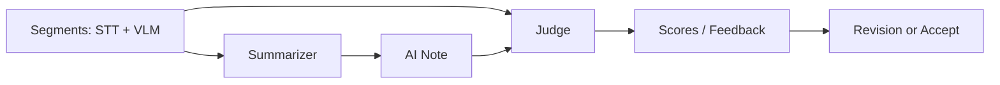
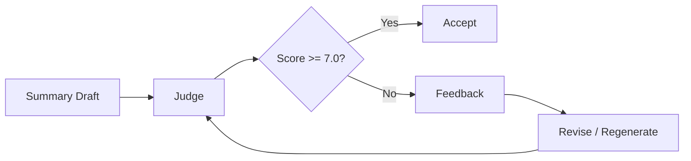

SeSAC:Note에서 Judge는 정답 판별기가 아닙니다. Judge는 Summarizer가 만든 노트를 원본 segment와 비교해 groundedness, note quality, multimodal use를 보조적으로 점검하는 gate입니다.

이 구분이 중요합니다. Judge 수치를 잘못 쓰면 생성 품질을 최종 판정한 것처럼 보일 수 있습니다. 이 글에서는 Summarizer와 Judge를 왜 나눴는지, benchmark 수치를 어떻게 제한해서 해석해야 하는지 정리합니다.

## Summarizer와 Judge를 분리한 이유

Summarizer의 역할은 노트를 생성하는 것입니다. Judge의 역할은 생성된 노트가 근거에 맞는지 점검하는 것입니다. 둘을 분리하면 생성과 평가의 책임이 나뉩니다.



Summarizer가 좋은 문장을 만들더라도 원본 근거와 맞지 않으면 학습 노트로는 위험합니다. 반대로 원본 근거만 나열하면 읽기 좋은 노트가 되지 않습니다. 그래서 생성과 평가를 분리해 서로 다른 관점으로 보게 했습니다.

Judge는 기준 점수에 미달한 결과에 대해 피드백을 만들고, 그 피드백을 바탕으로 요약을 보완하거나 재생성하는 loop로 설명할 수 있습니다. 다만 최종 판정 장치가 아니라 위험을 줄이는 보조 점검 loop로 보는 것이 맞습니다.



여기서 `7.0`은 프로젝트 기록에 남은 gate 기준이다. 모든 강의에서 이 기준이 절대적인 품질 기준이라는 의미는 아니다.

## 평가 축

Judge는 요약을 하나의 점수로만 보지 않는다. 프로젝트 기록에서는 다음 축이 중요하게 다뤄졌다.

| 평가 축 | 의미 |
| --- | --- |
| groundedness | 생성 내용이 원본 segment 근거와 맞는가 |
| note quality | 학습자가 읽기 좋은 구조인가 |
| multimodal use | 화면 정보와 음성 정보가 함께 반영됐는가 |
| rule compliance | 출력 형식과 작성 규칙을 지켰는가 |

이 축들은 품질 보증이 아니라 점검 기준이다. LLM Judge 역시 LLM이므로 실수할 수 있다. 따라서 Judge 결과는 자동 검사의 한 종류로 보고, 제한된 benchmark 기준으로만 해석한다.

<details markdown="1">
<summary markdown="span">평가 모듈의 입력·출력과 가중치</summary>



<p>Judge 모듈은 생성된 요약 콘텐츠의 품질을 보증하는 단계</p>
<ul>
<li>입력 : 생성된 요약본 <code>segment_summaries.jsonl</code>+ 원본 STT/이미지 싱크 데이터 <code>segments_units.jsonl</code></li>
<li>평가 : 정해진 항목으로 평가</li>
<li>산출 : 가중치가 적용된 종합 점수와 개선 사항이 담긴 한국어 한 줄 피드백.</li>
</ul>
<p><code>src/judge/judge.py</code><strong>: 요약 결과 평가</strong></p>
<ul>
<li>생성된 요약 콘텐츠가 신뢰 가능(groundedness, multimodal_use)하고, 규칙 준수(compliance) 및 교육적 가치(note_quality)가 있는지 평가</li>
<li>처리 로직<ol>
<li>요약본과 원본 근거 데이터를 로드하고 ID 매칭 수행</li>
<li>segments_units를 batch_size 단위로 분할</li>
<li>Gemini 모델로 평가 요청(병렬 처리 지원)</li>
<li>LLM이 반환한 3가지 항목의 점수를 가중치를 적용해 계산 후 정규화를 통해 최종 점수를 계산</li>
<li>최종 리포트 및 세그먼트별 상세 리포트를 JSON으로 저장</li>
</ol>
</li>
</ul>
<p><code>config/judge/prompts.yaml</code><strong>: 평가 기준 프롬프트</strong></p>
<ul>
<li>목적: 토큰 소모를 최소화하면서 핵심만 빠르게 평가.</li>
<li>구조 :<ol>
<li>System : &quot;엄격한 AI 평가자&quot; 페르소나 부여.</li>
<li>Criteria (채점 기준표) :</li>
</ol>
<div class="table-wrapper"><table>
<tr><th><strong>항목</strong></th><th><strong>가중치</strong></th><th><strong>설명</strong></th></tr>
<tr><td><strong>groundedness</strong></td><td>45%</td><td>주장이 근거에 의해 완벽히 지지되는가? (Hallucination 방지)</td></tr>
<tr><td><strong>note_quality</strong></td><td>35%</td><td>영상 없이도 이해 가능한 독립적인 학습 노트인가?</td></tr>
<tr><td><strong>compliance</strong></td><td>20%</td><td>JSON 스키마 및 금지어 규칙을준수했는가?</td></tr>
<tr><td><strong>multimodal_use</strong></td><td>참고</td><td>시각 정보(cap_ids)를 적절히 활용했는가?</td></tr>
</table></div>
<ol>
<li>Protocol: Validation Report 확인 -&gt; 의미론적 근거 검증 -&gt; JSON 출력 순서 강제.</li>
</ol>
</li>
</ul>
<p><strong>최종 정리</strong></p>
<pre><code>{
&quot;pass&quot;: true, // 최종 통과 여부 (boolean)
&quot;final_score&quot;: 10.0, // 최종 점수 (10점 만점)
&quot;min_score&quot;: 7.0, // 통과 기준 점수
&quot;model&quot;: &quot;gemini-3-flash-preview&quot;, // 사용된 Judge LLM 모델
&quot;prompt_version&quot;: &quot;v3&quot;, // 프롬프트 버전
&quot;generated_at_utc&quot;: &quot;...&quot;, // 생성 시간 (UTC)
&quot;feedback&quot;: [ // 세그먼트별 피드백 (선택적일 수 있음)
{
&quot;segment_id&quot;: 1,
&quot;feedback&quot;: &quot;VLM 텍스트와 레이아웃 정보를 바탕으로...&quot;
},
    ...
  ],
&quot;report&quot;: { // 상세 평가 리포트
&quot;scores_avg&quot;: {
&quot;groundedness&quot;: 10.0, // 근거 기반 점수 (환각 여부 등)
&quot;multimodal_use&quot;: 10.0, // 멀티모달 정보 활용도
&quot;note_quality&quot;: 10.0, // 노트 품질
&quot;compliance&quot;: 10.0, // 지시 이행도
&quot;final&quot;: 10.0 // 최종 평균점
},
&quot;segments&quot;: {
&quot;matched&quot;: 3,
&quot;missing_summaries&quot;: [],
&quot;missing_units&quot;: []
}
}
}
</code></pre>



</details>

## Judge prompt 개선 흐름

초기 Judge prompt는 평가 조건이 많고 모호하면 모델의 판단이 흔들릴 수 있다. 평가 기준이 복잡하면 토큰 사용량도 늘고, 응답 시간도 늘어난다.

개발 과정에서는 평가 축을 줄이고, 출력 구조를 단순화하고, retry/self-correction 흐름을 조정하는 방향이 정리됐다.

| 개선 방향 | 목적 |
| --- | --- |
| 평가 축 축소 | 모델이 무엇을 봐야 하는지 명확히 함 |
| 출력 구조 단순화 | parsing과 downstream 처리를 쉽게 함 |
| prompt 압축 | 토큰 사용량과 응답 시간을 줄임 |
| retry 조건 정리 | 불필요한 재시도를 줄임 |

프로젝트 기록 기준으로 별도 실험에서는 Judge 통과율이 80%에서 95%로 개선된 사례가 정리되어 있다. 이 수치는 해당 문서의 실험 조건 기준이며, 전체 서비스 품질을 의미하지 않는다.

요약 쪽에서는 항목마다 참고한 VLM unit id를 evidence로 남기는 방식도 정리됐다. 이렇게 하면 Judge가 생성 문장을 원본 segment와 비교하기 쉬워지고, 나중에 사용자가 "이 요약이 어디서 왔는가"를 추적할 수 있다. 핵심은 환각을 없앴다고 말하는 것이 아니라, 근거 추적 가능성을 높였다고 말하는 것이다.

## 제한된 benchmark 결과

Judge benchmark는 세그먼트 8개, batch size 4, worker 2개, 합격 임계값 7.0점, Summarizer 5개 설정을 기준으로 정리된 제한된 비교다. 먼저 scoring rule부터 다르다.

```text
Judge v1/v2 = 0.45 * groundedness + 0.20 * compliance + 0.35 * note_quality
Judge v3    = 0.50 * groundedness + 0.50 * note_quality
```

v3는 compliance 축을 제거하고 groundedness와 note quality에 집중한다. 따라서 v1, v2, v3의 점수는 같은 시험지의 절대 점수처럼 비교하면 안 된다. 더 안전한 해석은 "같은 프로젝트 benchmark 조건에서 prompt 버전별 평가 시간, 토큰 사용량, 통과 여부를 비교했다"이다.

| Judge 버전 | 평균 점수 | 점수 범위 | 평균 평가 시간 | 평균 토큰 | benchmark 통과 |
| --- | ---: | ---: | ---: | ---: | ---: |
| v1 | 7.78 | 6.96~8.88 | 31.6초 | 16,370 토큰 | 4/5 |
| v2 | 9.72 | 9.45~9.96 | 28.2초 | 15,478 토큰 | 5/5 |
| v3 | 9.67 | 9.44~10.00 | 14.7초 | 14,734 토큰 | 5/5 |

이 benchmark 조건에서 v3는 v1 대비 Judge 평가 단계 평균 시간이 53.5% 짧게 기록됐고, 평균 토큰 사용량은 10.0% 낮게 기록됐다. 이 수치는 전체 파이프라인 latency나 서비스 품질 개선율이 아니라 Judge 평가 단계의 비교 지표다.

상세 조합 중에는 `Summarizer v3 + Judge v3`가 10.00점, 14.8초, 13,980 토큰으로 기록되어 있다. 이 역시 해당 benchmark 조건의 조합 결과이며, 모든 영상 요약의 품질을 보장하는 숫자는 아니다.

실패 사례도 같이 봐야 한다. `Summarizer v3.2 + Judge v1` 조합은 6.96점으로 임계값 7.0점에 미달했고, 주요 원인은 compliance 축 해석 실패로 정리되어 있다. 이 사례는 Judge prompt가 길고 많은 규칙을 담는다고 항상 더 안전한 것은 아니라는 점을 보여준다.

이 표에서 가장 조심해야 할 숫자는 `5/5`와 `53.5%`다. `5/5`는 제한된 benchmark 조건에서 5개 설정이 모두 통과했다는 뜻이다. 모든 강의 영상에서 정확하다는 의미가 아니다. `53.5%`는 Judge 평가 단계 기준 시간 감소다. 전체 서비스 처리 시간이 그만큼 줄었다는 의미가 아니다.

## 수치 해석 한계

Judge benchmark는 유용하지만 한계가 있다.

| 한계 | 해석 |
| --- | --- |
| 표본 제한 | 일부 설정과 sample 기준 결과 |
| scoring rule 변화 | 버전 간 점수 절대 비교가 어려울 수 있음 |
| LLM Judge 자체의 불확실성 | 평가 모델도 오류 가능성이 있음 |
| 서비스 전체와 분리 | Judge 단계 수치가 전체 UX를 대표하지 않음 |

따라서 "benchmark 조건에서 평가 단계 효율 개선이 관찰됐다" 정도로 해석하는 것이 안전하다.

<details markdown="1">
<summary markdown="span">Judge (src/judge) 개발 이력</summary>



<div class="table-wrapper"><table>
<tr><th>Date</th><th>Change Bundle</th><th>Category</th><th>Evidence</th><th>Impact</th></tr>
<tr><td>01/07</td><td>Judge 초기 구성(가중치 기반 평가 + 배치 처리)</td><td>QA</td><td><code>465c392</code><strong> </strong></td><td>품질 기준 “정의” 완료</td></tr>
<tr><td>01/08</td><td>점수 인플레이션 해결: 0~10 엄격 기준 정립</td><td>Quality</td><td><code>b5ba590</code></td><td>과대평가 방지</td></tr>
<tr><td>01/09</td><td>병렬 처리 도입(ThreadPoolExecutor)</td><td>Perf</td><td><code>7d35075</code></td><td>평가 속도 약 40% 개선</td></tr>
<tr><td>01/09</td><td>ADK UI 연동(버튼 클릭 평가)</td><td>DevEx</td><td><code>a7baa8a</code><strong> </strong></td><td>데모/운영 편의 향상</td></tr>
<tr><td>01/10</td><td>피드백을 한 줄로 압축(토큰 절감)</td><td>Cost</td><td><code>723709c</code><strong> </strong></td><td>평가 비용/지연 감소</td></tr>
<tr><td>01/15</td><td>프롬프트/설정 파일 분리(prompt.yaml)</td><td>DevEx</td><td><code>723709c</code></td><td>유지보수성 향상</td></tr>
<tr><td>01/16</td><td>Feedback loop 리팩토링(최대 2회 재시도)</td><td>Reliability</td><td><code>c64f53c</code></td><td>“자가 교정” 품질 보증 완성</td></tr>
<tr><td>01/19</td><td>Judge 프롬프트 
v2/v3 추가</td><td>Reliability</td><td><code>7be6ad1</code>
Issue #91</td><td>summarizer (v3) 조합.
v2 (34.2초, 14,131) → 
v1 (17.6초, 14,704) →
v3 (14.8초, 13,980)</td></tr>
<tr><td>02/07</td><td>배치 간 
Context Chaining </td><td>Reliability</td><td><code>c1fe261</code>
</td><td>Summarizer→ Judge 
문맥 연속성 확보, 맥락 단절 해결</td></tr>
</table></div>



</details>

## Judge 해석에서 주의할 점

Judge는 품질을 높이는 데 도움을 줄 수 있지만, 생성 품질을 최종 판정하지 않는다. 특히 강의 유형이 달라지면 VLM 입력, STT 품질, Fusion 정확도, 요약 난도도 달라진다.

SeSAC:Note에서 Judge의 역할은 다음으로 제한한다.

1. 생성 요약을 원본 segment와 비교한다.
2. groundedness와 note quality를 자동 점검한다.
3. benchmark 조건에서 prompt 버전 간 차이를 관찰한다.
4. 사람이 확인해야 할 위험을 줄이는 보조 gate로 사용한다.

다음 글에서는 마지막으로 프로젝트를 마치며 남은 한계와 개선 방향을 정리한다.

- 이전 글: [08. QA 설계: 영상 근거 안에서만 답하게 만들기]()
- 다음 글: [10. 프로젝트 회고: 멀티모달 AI 서비스에서 배운 것]()
