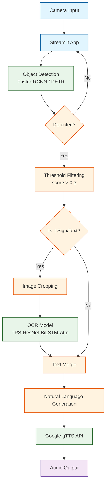

## 시각장애인을 위한 안내 서비스 (견: 見)

> **프로젝트 기간**: 2025.07 ~ 2025.09 (3개월)  
> **목적**: 실시간 카메라 영상에서 주변 정보를 인식해 음성으로 안내하는 모델 제작<br>
> **역할**: 객체 탐지 모델 학습, OCR 데이터 처리 흐름 구축, Streamlit 웹 서비스 개발

<br>

## 카메라로 인식한 주변 정보를 음성으로 전달했다

시각 정보에 접근하기 어려운 사용자가 주변 상황과 안내판의 글자를 음성으로 확인할 수 있도록 이 프로젝트를 시작했습니다. 이미지 인식을 일상에서 필요한 정보를 얻는 데 활용하고자 했습니다.

서비스는 카메라 영상에서 장애물과 안내판을 찾고, 안내판의 글자를 읽어 음성으로 전달합니다. 주변 객체를 탐지하는 모델과 글자를 읽는 모델을 연결해 구성했습니다.

<br>

## 객체 탐지, 문자 인식, 음성 출력을 연결한 구조

### 전체 처리 흐름

카메라 이미지는 먼저 객체 탐지 모델을 거칩니다. 위험물이나 안내판을 감지하면 글자가 있는 관심 영역(ROI)을 잘라 OCR 모델로 전달합니다. 마지막으로 탐지 결과와 인식한 글자를 문장으로 합쳐 음성 합성(TTS)으로 안내합니다.



## 구현에 사용한 기술

### 인공지능과 데이터 처리

- **객체 탐지**: MMDetection, Facebook DETR, Faster-RCNN
- **OCR**: NAVER Clova TRBA (TPS-ResNet-BiLSTM-Attn)
- **딥러닝 프레임워크**: PyTorch, TorchVision
- **라이브러리**: OpenCV, Pandas, NumPy, PIL

### 애플리케이션과 실행 환경

- **웹 프레임워크**: Streamlit
- **API**: Google gTTS (Text-to-Speech), Naver Cloud Platform (OCR API)
- **실행 환경**: Python 3.8+

<br>

## 주요 기능과 구현 코드

### 1. 객체 탐지

MMDetection 라이브러리로 29가지 장애물을 탐지합니다. `inference_detector`의 결과 중 신뢰도 임계값 0.3 이상인 객체만 남깁니다.

```python
# Visually_Impaired_Service/Front Streamlit/Object_Detection.py

import mmcv
from mmdet.apis import (inference_detector, show_result_pyplot)

def object_detection(img):
    # 사전 학습된 Faster-RCNN 모델 로드
    model = torch.load('./model_pt/faster-rcnn_model_0.44.pt')

    # 추론 실행
    result = inference_detector(model, img)
    
    # 결과 필터링 및 후처리
    class_number = []
    result_list = []
    ocr_list = []
    
    for i, j in enumerate(result):
        if len(j) != 0:
            for k in j:
                # Threshold 0.3 이상인 물체만 선별
                if k[-1] > 0.3:
                    class_number.append(i)
                    # 안내판, 표지판 등 글자가 있는 객체는 별도 리스트(ocr_list)로 관리
                    if i in [0, 6, 10, 12]:
                        result_list.append(k)
                        ocr_list.append(i)
    
    # ... (중략) ...
    
    # 탐지된 정보를 바탕으로 안내 멘트 생성
    object_text = '앞에 ' + ', '.join(object_list) + '가 탐지되었습니다.'
    return object_text, ocr_list, cut_list
```

### 2. OCR로 안내판 글자 읽기

탐지한 객체가 안내판이나 표지판이면 해당 영역을 잘라 문자 인식(OCR) 모델로 전달합니다. TRBA(TPS-ResNet-BiLSTM-Attn) 구조를 사용했으며, 불규칙한 형태의 글자에서도 높은 인식률을 보였습니다.

TRBA는 다음 네 단계로 문자를 인식합니다.

1. **형태 보정(TPS)**: 휘어진 글자를 편다.
2. **특징 추출(ResNet)**: 이미지의 특징을 추출한다.
3. **순서 정보 처리(BiLSTM)**: 추출한 특징을 순서대로 읽으며 앞뒤 관계를 반영한다.
4. **문자 예측(Attention)**: 최종 문자열을 예측한다.

```python
# Visually_Impaired_Service/Optical Character Recognition/model.py

class Model(nn.Module):
    def __init__(self, opt):
        super(Model, self).__init__()
        self.stages = {'Trans': opt.Transformation, 'Feat': opt.FeatureExtraction,
                       'Seq': opt.SequenceModeling, 'Pred': opt.Prediction}

        # 1. Transformation: TPS (Thin Plate Spline)
        if opt.Transformation == 'TPS':
            self.Transformation = TPS_SpatialTransformerNetwork(
                F=opt.num_fiducial, I_size=(opt.imgH, opt.imgW), ...
            )

        # 2. FeatureExtraction: ResNet
        if opt.FeatureExtraction == 'ResNet':
            self.FeatureExtraction = ResNet_FeatureExtractor(opt.input_channel, opt.output_channel)

        # 3. Sequence Modeling: BiLSTM
        if opt.SequenceModeling == 'BiLSTM':
            self.SequenceModeling = nn.Sequential(
                BidirectionalLSTM(self.FeatureExtraction_output, opt.hidden_size, opt.hidden_size),
                BidirectionalLSTM(opt.hidden_size, opt.hidden_size, opt.hidden_size))

        # 4. Prediction: Attention
        if opt.Prediction == 'Attn':
            self.Prediction = Attention(self.SequenceModeling_output, opt.hidden_size, opt.num_class)
```

### 3. OCR API 결과를 안내 문장으로 변환

자체 학습한 모델과 Naver Cloud Platform OCR API를 함께 사용해 텍스트를 인식합니다.

```python
# Visually_Impaired_Service/Front Streamlit/OCR.py

def ocr(ocr_list, cut_list):
    # ... (API 설정 코드 생략) ...
    
    ocr_text_list = []
    
    for i in cut_list:
        # Crop된 이미지를 API로 전송
        response = requests.request("POST", api_url, headers=headers, data=payload, files=files)
        res = json.loads(response.text.encode('utf8'))
        
        # 결과 파싱
        ocr_text = ""
        for field in res['images'][0]['fields']:
            ocr_text += field['inferText'] + " "
            
        # 자연스러운 문장 생성
        if len(ocr_text) != 0:
            for i in ocr_list:
                ocr_text_list.append(label_list[i] + '에는 "' + ocr_text + '" 라고 적혀져 있습니다.')

    return ','.join(ocr_text_list)
```

## 프로젝트 결과

### 모델 성능

- **객체 탐지(Faster-RCNN)**: mAP 0.44 달성 (Custom Dataset 기준)
- **문자 인식(TRBA)**: 단어 단위 정확도(Word Accuracy) 85% 이상 (Scene Text Dataset 기준)

### 시연 시나리오

1. **상황**: 사용자가 버스 정류장 앞에 서 있음
2. **탐지**: "전방에 버스 정류장과 사람 2명이 탐지되었습니다." (Object Detection)
3. **인식**: "버스 정류장 안내판에는 '7016번 도착 예정'이라고 적혀 있습니다." (OCR)
4. **출력**: 위 문장을 합성하여 음성으로 안내

<br>

## 구현 과정에서 익힌 것

1. **전체 처리 흐름 구축**: 웹캠 입력부터 객체 탐지, 문자 인식, 음성 출력까지 이어지는 처리 흐름을 구현했습니다.
2. **모델 선택**: YOLO, DETR, Faster-RCNN을 비교하며 처리 속도와 정확도를 함께 고려하는 경험을 쌓았습니다.
3. **데이터 전처리**: OCR 성능을 높이기 위해 TPS(Spatial Transformer Network) 모듈과 여러 데이터 증강 기법을 적용했습니다.

<br>

## 관련 링크

- **GitHub 저장소**: [Visually_Impaired_Service](https://github.com/figure-2/Visually_Impaired_Service)
