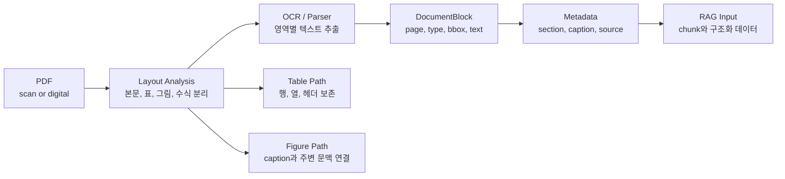

처음에는 PDF 처리를 단순하게 생각했습니다. 파서(parser)로 텍스트를 추출한 뒤 RAG에 넣으면 된다고 봤습니다.

문서 처리 흐름을 다시 그려보면서 생각이 바뀌었습니다. PDF/OCR에서 어려운 부분은 “읽는 것”보다 “읽은 결과를 어떤 구조로 남길 것인가”였습니다. 본문·표·그림·수식에 페이지 번호와 설명(caption), 절(section) 정보까지 섞이면 OCR 모델 하나만으로는 검색 품질 문제를 해결할 수 없습니다.



## 내가 헷갈렸던 부분

텍스트를 추출한 뒤에도 정해야 할 것이 남아 있었습니다. 본문과 표를 같은 방식으로 나눠도 되는지, 그림 설명과 페이지 정보는 어떻게 남길지 정리해 봤습니다.

| 헷갈린 지점 | 다시 정리한 기준 |
| --- | --- |
| OCR 정확도가 높으면 충분한가 | 정확한 글자보다 문서 구조 보존이 중요하다 |
| 표는 텍스트처럼 chunking하면 되는가 | 표는 행/열 관계가 깨지면 의미가 사라진다 |
| 그림은 설명을 생략해도 되는가 | Figure/Table caption이 답변 근거가 될 수 있다 |
| 페이지 단위로 저장하면 되는가 | 질문 단위에 따라 section, figure, table metadata가 필요하다 |

PDF 처리는 “텍스트 파일 만들기”에서 끝나지 않습니다. 이후 검색·요약·QA·번역·오디오 변환에 사용할 수 있도록 문서 구조도 함께 남겨야 합니다.

## 문서를 읽은 뒤 남겨야 할 것

이 목표에 맞춰 처리 단계를 나누고, 각 단계에서 무엇을 남겨야 하는지 정리했습니다.

| 단계 | 역할 | 체크포인트 |
| --- | --- | --- |
| Layout Analysis | 본문, 제목, 표, 그림, 수식 영역 분리 | OCR 전에 영역을 나눴는가 |
| OCR / Parser | 영역별 텍스트 추출 | 스캔본과 디지털 PDF를 분리했는가 |
| Table 처리 | 행, 열, 헤더, 셀 관계 보존 | 행 단위로 의미가 깨지지 않는가 |
| Figure 처리 | 그림 설명과 caption 연결 | 그림만 남고 설명이 사라지지 않는가 |
| Metadata 저장 | page, section, source, element type 저장 | 검색 결과가 원문 위치로 돌아갈 수 있는가 |
| RAG 입력화 | chunk와 구조화 데이터를 검색 단위로 변환 | chunk가 너무 작거나 크지 않은가 |

각 단계를 거치면서도 `element type`은 남겨야 합니다. 이 정보로 같은 텍스트라도 본문인지, 표의 셀인지, 그림 설명인지 구분할 수 있습니다. 이렇게 구분한 요소에 따라 답변에서 텍스트를 사용하는 방식도 달라집니다.

## 표 데이터는 따로 본다

표의 값은 행과 열의 관계 안에서 의미를 갖습니다. 예를 들어 재무 리포트의 “매출”, “영업이익”, “전년 대비”를 읽을 때는 값뿐 아니라 어떤 항목과 기간을 가리키는지도 함께 봐야 합니다.

표를 RAG에 넣을 때도 이 관계가 유지되는지부터 확인해야 합니다.

| 질문 | 이유 |
| --- | --- |
| 헤더가 보존됐는가 | 셀 값만 있으면 값의 의미를 알 수 없다 |
| 행 단위와 표 단위 중 무엇을 검색할 것인가 | 너무 잘게 쪼개면 근거가 깨진다 |
| 표 주변 문단을 같이 저장할 것인가 | 표가 왜 등장했는지 설명이 필요하다 |
| 숫자 단위와 기간이 보존됐는가 | 금융/논문 문서에서는 단위 손실이 치명적이다 |

제가 보기에는 표를 Markdown이나 HTML로 변환한 뒤 표 전체와 핵심 행을 함께 저장하는 방식이 안정적이었습니다. 표 전체로 문맥을 보존하면서 핵심 행으로 검색 recall을 보완하는 방식입니다.

표 밖의 설명도 함께 살펴야 합니다. 주변 문단에 표의 등장 배경이나 해석이 담겨 있다면, 해당 문단을 표와 연결해 두는 편이 좋습니다. 표를 얼마나 작게 나누느냐보다, 나눈 뒤에도 값의 의미를 해석할 수 있느냐가 중요합니다.

## Parser 선택 기준

문서 파서를 고를 때도 “텍스트가 잘 나오나”만 확인해서는 부족합니다. 앞에서 살펴본 행·열 관계와 위치 정보가 출력에 남는지도 봐야 합니다.

| 기준 | 확인할 것 |
| --- | --- |
| Layout 보존 | 제목, 문단, 표, 그림 영역을 구분하는가 |
| 표 처리 | 표를 plain text로 뭉개지 않는가 |
| 이미지 처리 | OCR이 필요한 이미지 영역을 분리하는가 |
| Metadata | page, bbox, section 정보를 남기는가 |
| 후처리 난이도 | 결과를 DB나 vector store에 넣기 쉬운가 |

PDF가 길고 복잡할수록 파서 출력을 그대로 저장하기보다, 한 번 더 정규화해 구조를 맞추는 단계가 필요합니다.

## 다음에 다시 만들 때 볼 것

다음에 PDF/OCR 파이프라인을 만들 때는 문서 유형을 구분하는 데서 시작해, 답변의 근거를 원문에서 다시 찾을 수 있는지까지 차례로 확인하려고 합니다.

| 체크 | 질문 |
| --- | --- |
| 문서 유형 분리 | 스캔 PDF와 디지털 PDF를 구분했는가 |
| 구조 보존 | 본문, 표, 그림, 수식을 분리했는가 |
| 단위 설계 | page, section, element 중 검색 단위를 정했는가 |
| 표 보존 | 헤더와 셀 관계를 잃지 않았는가 |
| 그림 설명 | caption과 주변 문단을 연결했는가 |
| 근거 추적 | 답변에서 원문 위치로 돌아갈 수 있는가 |

## block type을 먼저 고정하는 코드

PDF/OCR 흐름을 코드로 정리할 때는 OCR 호출에 앞서 사용할 block type부터 정하는 것이 중요했습니다. title, plain text, figure, table, formula처럼 문서 요소의 종류를 먼저 정의하는 것입니다. 이 구분을 바탕으로 표는 행과 열의 관계를 살리고, 그림은 설명과 연결하며, 본문은 문단 단위로 처리할 수 있습니다.

아래 코드는 파서의 `label`을 `block_type`에 옮겨 공통 구조로 맞추는 설계 예시입니다.

```python
from dataclasses import dataclass


@dataclass
class DocumentBlock:
    page: int
    block_type: str  # table/figure/formula를 잃으면 뒤에서 복구하기 어렵다.
    text: str
    bbox: tuple[int, int, int, int] | None
    metadata: dict


def normalize_layout_blocks(raw_blocks: list[dict]) -> list[DocumentBlock]:
    # parser 결과를 바로 chunk로 만들지 않고, 먼저 공통 구조로 맞춘다.
    blocks = []
    for item in raw_blocks:
        blocks.append(
            DocumentBlock(
                page=item["page"],
                block_type=item["label"],
                text=item.get("text", ""),
                bbox=item.get("bbox"),
                metadata={"source": item.get("source")},
            )
        )
    return blocks
```

이 코드는 파서 결과를 바로 검색용 조각(chunk)으로 나누지 않고, 먼저 `DocumentBlock`으로 맞춥니다. 이후 RAG나 요약 단계에서 필요한 단위로 다시 변환하는 편이 안전합니다.

## 내가 남긴 결론

PDF/OCR은 RAG 앞단에서 텍스트만 추출하는 단순 전처리로 보기 어렵습니다. 읽은 내용을 어떤 단위로 저장하고 어떤 메타데이터를 남기느냐에 따라 뒤의 검색 품질이 달라집니다. 복잡한 PDF를 다룰수록 OCR 정확도만 확인할 것이 아니라, 본문·표·그림의 관계와 원문 위치를 보존할 저장 구조부터 정해야 합니다.
